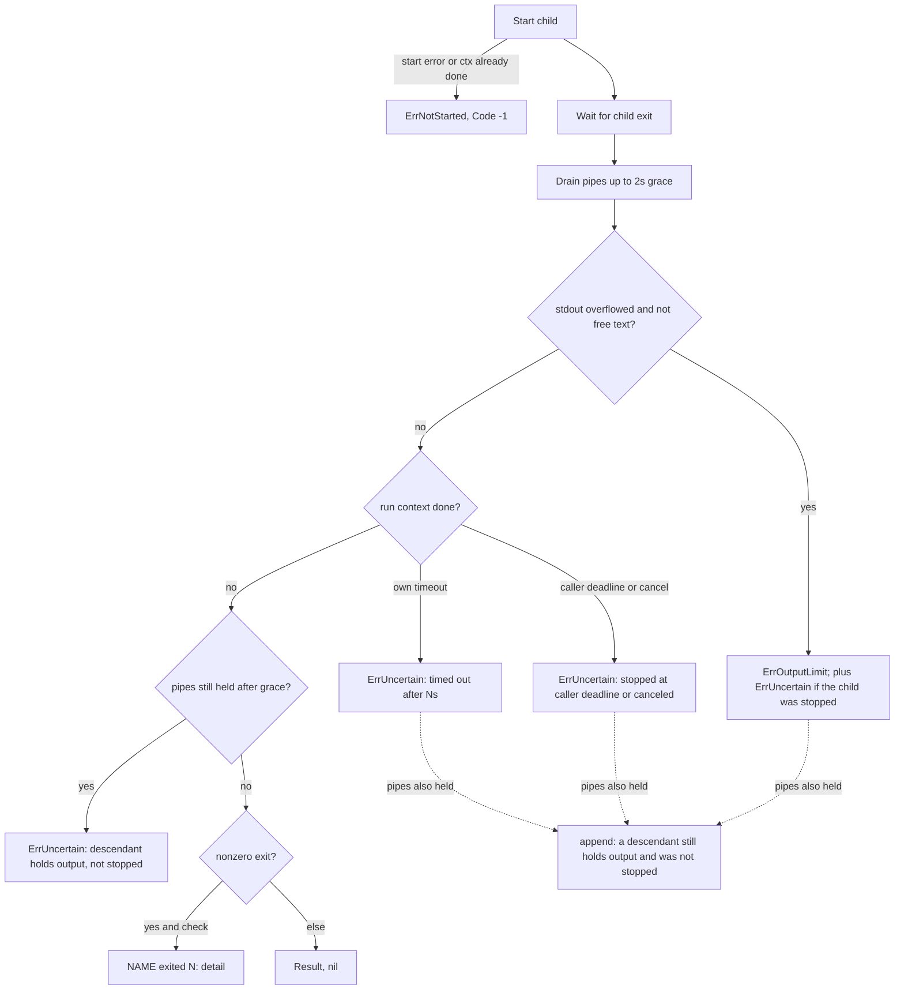

# Bounded helper subprocess execution - Plan

## Goal Capsule

- **Objective:** A coordinator or worker command that shells out to git, gh, herdr, codegraph, ps, or lsof returns within a known bound with a truthful outcome: it never hangs on a stuck or pipe-holding helper, never exhausts memory on runaway output, never accepts truncated or incomplete structured output as an observation, and never reports a timeout or cancellation as a successful exit.
- **Means:** Harden the one existing runner in `go/internal/proc` with caller context, bounded streaming capture, classified errors, and a bounded pipe drain, then move graph commands and a bounded set of cheap helper calls onto it while deleting their duplicated exec plumbing (KTD1-KTD6).
- **Authority:** Issue #208, then this plan, then `VERIFY.md` and the existing feature maps.
- **Stop:** No new execution package, watchdog, polling loop, process-group or blanket SIGKILL policy, or arbitrary process cleanup. Do not remove or change eager graph indexing (#203). Do not restructure init/inbox maintenance (#206). Do not sweep project verification, lint, the evidence publisher, or interactive harness launches into the helper default.
- **Execution profile:** Standard Go change with new unit tests per package plus the full offline suite through the canonical verifier.
- **Who finishes:** The implementer lands, verifies, opens the PR, and (granted for this run) squash-merges after CI is green.

---

## Product Contract

### Summary

`proc.RunContext` becomes the single helper execution implementation, with `proc.Run` kept as a documented compatibility wrapper.
It honors the tighter of the caller's deadline and the command bound, caps stdout and stderr while reading them, rejects stdout that overflowed, classifies not-started, uncertain, and output-limit failures, and stops waiting for a helper's output a short grace after the helper exits or is stopped.
Graph init/status/version, the Herdr CLI executors, the GitHub PR observation, the process-table reads, four identical `runGit` copies, and `roleinit`'s git call move onto it.

### Problem Frame

`proc.Run` starts its timeout from `context.Background()`, so a caller with a shorter operation budget cannot pass it down; that blocks #206's pass budgets.
It captures output into unbounded buffers and truncates only afterwards, so a runaway helper can grow memory until the timeout.
A helper that exits while a descendant keeps its stdout open blocks `cmd.Run` indefinitely.
On timeout, `Result.Code` stays `0`, and several callers that ignore the error and test `Code == 0` read a timeout as success (for example `updatecmd` fast-forward and dirty checks, cleanup branch presence).
Graph init has no timeout at all even though `docs/DEPENDENCIES.md` documents a 300 s bound; Herdr and GitHub observations each run their own exec copies, one of which (`mesh`) silently truncates stdout at 256 KiB and one of which (`prcmd`) parses combined stdout+stderr as JSON.

### Requirements

**Execution primitive**

- R1. A helper runs under the tighter of the caller's context deadline and its own command timeout; the default command timeout stays 20 s.
- R2. Explicit caller cancellation stops the direct child and returns an uncertain-effect error, never a code-zero result.
- R3. stdout and stderr are bounded while they are read; memory for one call stays within the configured limits plus a fixed read buffer.
- R4. stdout beyond its limit is an error (`ErrOutputLimit`) with `StdoutTruncated` set, unless the caller explicitly marks stdout as free text; stderr beyond its limit keeps the tail, sets `StderrTruncated`, and is not by itself an error.
- R5. A missing executable, or a caller context already done before start, is a not-started refusal (`ErrNotStarted`): nothing ran.
- R6. A timeout, cancellation, output-limit stop, or held output pipe is uncertain (`ErrUncertain`); `Result.Code` is `-1` whenever the outcome is not a completed exit (including a held output pipe), and the helper never retries.
- R7. After the direct child exits or is stopped, the caller waits at most a short fixed grace for its output pipes; a descendant still holding them makes the call uncertain and is named in the message whatever else happened (timeout, cancel, exit), and sum sends it no signal. Closing the read ends means such a descendant may fail on its next write (EPIPE/SIGPIPE from the kernel); the message says it may still be running, never that it stopped.
- R8. argv, cwd, env (nil inherits, explicit replaces), `ScrubbedEnv`, exit codes, `check=false` (nonzero exit returns the result and nil error), and the existing error texts (`NAME exited N: detail`, `NAME: timed out after Ns; its effect is unknown`) are preserved.

**Migrated callers**

- R9. `codegraph init` runs under the documented 300 s bound (`SUM_GRAPH_TIMEOUT` lab knob), a timeout records a `failed` attempt with the uncertain reason, and eager indexing behavior is otherwise unchanged.
- R10. `graph status` accepts only complete, in-limit JSON; anything else yields no live status and names the reason.
- R11. Herdr CLI calls (`herdrclient`, `mesh`) and the `pr` GitHub observation reject oversized or incomplete JSON instead of producing an observation; `prcmd` parses stdout only.
- R12. Remaining direct `exec.Command` sites are inventoried with a reason, and a test fails when a new unlisted site appears.

### Success Criteria

- Measured with isolated fixtures: peak memory for a 256 MiB stdout helper and a never-ending stdout helper stays near the stdout limit (before: grows with output), and the never-ending case returns in well under the command timeout.
- A helper that exits `0` while a background child holds stdout returns within the grace (before: never returns).
- Migrated/deleted wrapper counts are reported in the PR.

### Scope Boundaries

- Callers that ignore `proc.Run` errors are not rewritten wholesale; R6's `Code = -1` fixes the ones that test `Code == 0` as success. Callers that use `err != nil && Code == 0` as their did-not-run marker (`environment` lsof reads, `quota`) are fixed directly to `err != nil`, as is the `updatecmd` apply-path dirty check that guards a mutation.
- The graph build-slot, `deferred`, and `exhausted` behavior documented in `docs/DEPENDENCIES.md` but absent from the Go port stays with #203.

### Deferred to Follow-Up Work

- Threading caller contexts through `herdrclient`'s exported API and the return pump/lifecycle sweep (#206 consumes `proc.RunContext`).
- Moving the pipeline `gh` helpers, `devcmd`/`doctor`/`lsp`/`verifycontract` git and mise wrappers, `project`'s `runGit`/`runGitIgnoringExit` (its `git clone` needs a network-sized bound), and `machine`'s ioreg read onto `proc` (listed in the inventory with reasons).
- Refusing a `graph init` retry while a timed-out indexer is still bound to the checkout (build slots and retry admission belong to #203).

---

## Planning Contract

### Key Technical Decisions

- KTD1. **One implementation in `go/internal/proc`: `RunContext(ctx, Cmd)` plus the `Run(argv, cwd, timeout, check, env)` wrapper.** `Cmd` carries argv, dir, env, timeout, check, and optional per-call stdout/stderr limits and a free-text stdout flag; `Run` calls `RunContext(context.Background(), ...)` and is documented as the compatibility form for the 68 existing call sites. (session-settled: user-directed — chosen over a new runner/process-manager package: the issue forbids another execution framework.)
- KTD2. **Own pipes and copy goroutines instead of `exec.Cmd` buffers or `WaitDelay`.** The runner passes the write ends of `os.Pipe` pairs to the child, reads the read ends into capped buffers, and after `Wait` observes the child's exit it waits at most a fixed grace (2 s) for both readers before closing them (R7 states what that means for a descendant). `WaitDelay` was rejected because it reports `ErrWaitDelay` only when the child exited `0`; a nonzero exit with a held pipe would be indistinguishable from a clean one.
- KTD3. **stdout keeps the head and overflow is an error; stderr keeps the tail and overflow is a flag.** stdout feeds JSON and line tables (`ps`, `lsof`, `git status`) where a prefix is a wrong answer; stderr feeds diagnostics where the last lines matter. On stdout overflow the runner cancels the child immediately rather than waiting for the timeout. Defaults: 8 MiB stdout, 256 KiB stderr; `mesh` keeps its previous 256 KiB stdout bound.
- KTD4. **Errors are one `*proc.Error` type matched with `errors.Is` against `ErrNotStarted`, `ErrUncertain`, and `ErrOutputLimit`.** Messages keep today's wording where it exists; callers that only format `err.Error()` are unaffected.
- KTD5. **On deadline or cancel only the direct child is killed, exactly as `exec.CommandContext` does today; descendants are never signaled.** (session-settled: user-directed — chosen over watchdog or process-group supervision: issue boundaries forbid a watchdog, blanket SIGKILL policy, and arbitrary process cleanup.)
- KTD6. **Graph migration restores the documented 300 s init bound and `SUM_GRAPH_TIMEOUT` knob but keeps eager indexing.** (session-settled: user-directed — chosen over bundling #203's demand-driven indexing: separate issue scope.) `docs/DEPENDENCIES.md` is corrected to describe the direct-child stop instead of a process-group kill.
- KTD7. **Cheap helpers chosen for migration are the Herdr and GitHub observation executors plus identical `runGit` copies on init, dispatch, and context paths.** Interactive harness launches, project verification, lint, the evidence publisher, and the release archive pipe keep their own lifecycle owners. (session-settled: user-directed — chosen over migrating every exec call: issue scope item 5.)
- KTD8. **The inventory is a Go test, not a doc list.** `go/internal/proc/inventory_test.go` scans non-test Go sources for `exec.Command` and compares against an allowlist of file → reason, so the recorded exceptions cannot drift silently.

### High-Level Technical Design

Outcome classification after `RunContext` starts a child, in precedence order:

### Assumptions

- Headless run: the scoping confirmation was skipped; the limits (8 MiB / 256 KiB / 2 s grace) and the migrated set in KTD7 are this plan's defaults.
- Callers of `proc.Run` never legitimately need more than 8 MiB of stdout; the largest observed are `git ls-tree -r` and `git status --ignored` on sum-sized repositories. A cleanup `git status --ignored=matching` that overflows becomes a named blocker rather than a guess, which is the fail-closed direction cleanup already takes.
- Herdr's stderr error envelope is far below the 256 KiB stderr limit; if stderr ever overflows, the envelope fails to parse and the call surfaces as a generic failure, never as a conclusive `pane_not_found`/`agent_not_found` stop.
- The `prcmd` PR observation keeps gh's stderr in its failure message after moving JSON parsing to stdout only.

### Sources

- `go/internal/proc/proc.go`, `go/internal/graph/init.go`, `go/internal/graph/graph.go`, `go/internal/herdrclient/herdrclient.go`, `go/internal/mesh/runner.go`, `go/internal/prcmd/pr.go`.
- `docs/DEPENDENCIES.md` graph paragraph (300 s bound, `SUM_GRAPH_TIMEOUT`).
- Go `os/exec` `Wait`/`awaitGoroutines`: `ErrWaitDelay` is surfaced only when the process exited successfully (basis for KTD2).
- Comparative reference: herdr-projects `src/runner.rs` (explicit limits and testable command boundary).

---

## Implementation Units

### U1. Bounded, context-aware runner

- **Goal:** `proc.RunContext` implements R1-R8; `proc.Run` delegates to it.
- **Requirements:** R1-R8; KTD1-KTD5.
- **Dependencies:** none.
- **Files:** `go/internal/proc/proc.go`, `go/internal/proc/proc_test.go`.
- **Approach:**
  1. Add `Cmd`, the capped buffer (head or tail mode with a total-bytes counter), `Error` and the three sentinels.
  2. Build the run context from the caller context with `WithCancelCause` then `WithTimeout`; stdout overflow cancels with an overflow cause.
  3. Use `os.Pipe` pairs and copy goroutines (KTD2); close the parent's write ends after start.
  4. Classify per the design flowchart; set `Code = -1` when the child did not exit on its own.
  5. Keep `Run`'s signature and messages; `trimDetail` reads the retained stderr tail.
- **Patterns to follow:** existing `proc.Run` message wording; `Terminate`'s never-SIGKILL comment style for documenting KTD5.
- **Test scenarios:**
  - Caller deadline 200 ms with command timeout 20 s on `sleep 5` returns in under 2 s, `errors.Is(err, ErrUncertain)`, `Code == -1`, message names the caller deadline.
  - Command timeout 300 ms with a 20 s caller deadline on `sleep 5` returns the existing `timed out after` message, uncertain.
  - Explicit `cancel()` mid-run on `sleep 5` returns uncertain with a canceled message.
  - Context already canceled before start: `ErrNotStarted`, the helper's side-effect file is not created.
  - Missing executable: `ErrNotStarted`, message keeps `NAME: ...` form.
  - `sh -c 'echo oops >&2; exit 3'` with `check=true` returns `exited 3: oops`; with `check=false` returns `Code 3`, nil error.
  - Helper printing 32 MiB to stdout with an 8 MiB limit: `ErrOutputLimit`, `StdoutTruncated`, retained stdout exactly the limit.
  - Never-ending stdout (`yes`) with 1 MiB limit and 20 s timeout returns in under 2 s with `ErrOutputLimit` and `ErrUncertain`.
  - Free-text stdout overflow returns the head, `StdoutTruncated`, nil error.
  - 4 MiB to stderr with 64 KiB stderr limit keeps the tail (last marker present), `StderrTruncated`, nil error on exit 0.
  - `sh -c 'sleep 30 & echo hi'` returns within the grace plus slack with `ErrUncertain`, `Code 0`, stdout `hi`, and the message says the descendant was not stopped; the test then stops the sleeper it created.
  - Timeout after a side effect: helper appends a line to a file then sleeps; after timeout the file holds exactly one line (no replay).
  - `env` nil inherits a marker variable; explicit `env` replaces it; `cwd` is honored.
- **Verification:** `go test ./internal/proc` passes, and existing callers compile unchanged.

### U2. Process-table reads on the runner

- **Goal:** the three `ps` calls in `go/internal/proc/inspect.go` use `Run` so they are bounded and fail closed on truncation.
- **Requirements:** R3, R4, R6; KTD3.
- **Dependencies:** U1.
- **Files:** `go/internal/proc/inspect.go`.
- **Approach:** call `Run` with `check=true` and a 30 s bound matching the adjacent `lsof` call; keep the existing error texts (`process table cannot be inspected: ...`).
- **Patterns to follow:** `cwdProcesses` in the same file.
- **Test scenarios:** Test expectation: none -- behavior is covered by existing `go/internal/cleanup` and `go/internal/execution` stop tests that exercise `Descendants`, `ProcessArgv`, and `ProcessesBoundTo`.
- **Verification:** existing cleanup/execution tests pass.

### U3. Graph commands on the runner

- **Goal:** graph identity git calls, `codegraph init`, `codegraph status --json`, and `codegraph --version` run through `proc` (R9, R10).
- **Requirements:** R9, R10; KTD6.
- **Dependencies:** U1.
- **Files:** `go/internal/graph/init.go`, `go/internal/graph/graph.go`, `go/internal/graph/init_test.go`, `docs/DEPENDENCIES.md`.
- **Approach:**
  1. Replace `runGit` with a `proc.Run` call helper that trims stdout; delete the exec plumbing.
  2. `runCodegraph` uses `proc.RunContext` with the codegraph env, cwd, and `graphTimeout()` (300 s default, `SUM_GRAPH_TIMEOUT` seconds override).
  3. `StatusTask` runs `status --json` through `proc`, decodes only a clean in-limit stdout, and sets `live.error` when the observation failed.
  4. `Tool` runs `--version` through `proc` with its existing 60 s bound and reason texts.
- **Patterns to follow:** existing record/attempt shape in `InitCheckout`.
- **Test scenarios:**
  - Fake codegraph whose `init` sleeps 30 s with `SUM_GRAPH_TIMEOUT=1`: `InitCheckout` returns within a few seconds, state `failed`, the last attempt is `init` not ok with a `timed out` error.
  - Fake codegraph that, like the real launcher chain (sh shim, node shim, `spawnSync` indexer), runs its sleeping indexer as a grandchild: the timed-out attempt's error also says a descendant still holds output and was not stopped.
  - Fake codegraph whose `init` succeeds: state `ready`, `indexed_head` equals HEAD.
  - Fake `status --json` printing incomplete JSON: `StatusTask` returns `live.status` absent and `live.error` naming the JSON failure.
  - Fake `status --json` printing valid JSON with `pendingChanges.added = 1`: freshness `stale`.
- **Verification:** new graph tests and existing `go/internal/cli` graph and demo tests pass.

### U4. Herdr and GitHub observations on the runner

- **Goal:** `herdrclient.runRaw`, `mesh.herdrRunner.Run`, and the `prcmd` PR observation and visibility read execute through `proc` (R11).
- **Requirements:** R4, R6, R11; KTD3, KTD7.
- **Dependencies:** U1.
- **Files:** `go/internal/herdrclient/herdrclient.go`, `go/internal/herdrclient/herdrclient_test.go`, `go/internal/mesh/runner.go`, `go/internal/mesh/runner_test.go`, `go/internal/prcmd/pr.go`, `go/internal/prcmd/publish.go`.
- **Approach:**
  1. `runRaw` keeps its tuple return and nonzero-exit semantics (`check=false`) but delegates to `proc.RunContext`; `run` keeps its `exited N` detail.
  2. `mesh.herdrRunner.Run` passes its parent context and a 256 KiB stdout limit; the `text` path marks stdout free text and appends an explicit truncation line; delete `limitedBuffer`; keep `remoteError` for nonzero exits.
  3. `prcmd` PR view uses stdout only with a 120 s bound matching the pipeline `gh` default; `observedVisibility` gets the same bound.
- **Patterns to follow:** existing `Observe`/`decodeHerdr` error texts; pipeline `bound(timeout)` default.
- **Test scenarios:**
  - Fake herdr printing incomplete JSON: `Observe` returns an error and no value.
  - Fake herdr printing more than the stdout limit: `Call` returns an output-limit error, not a decoded value.
  - Fake herdr exiting 1 with a `{"error":{"code":"pane_not_found"}}` stderr envelope: `Observe` returns code `pane_not_found`, nil error (unchanged).
  - Fake herdr sleeping past a 300 ms timeout: error keeps `timed out after` wording and is uncertain.
  - Mesh runner over its stdout limit on the JSON path: error; on the text path: the head plus a truncation line.
  - `pr` observation with a fake gh writing a warning to stderr and valid JSON to stdout records the observation (previously failed parsing).
- **Verification:** new tests plus existing `go/internal/cli` pr, rundown, and mesh tests pass.

### U5. Duplicated git helpers and the ioreg timeout

- **Goal:** identical `runGit` copies in `contextview`, `evidenceview`, `release`, and `prepare`, plus `roleinit`'s git call, run through `proc.Run`; callers using `Code == 0` as a did-not-run marker are corrected.
- **Requirements:** R8, R12; KTD7.
- **Dependencies:** U1.
- **Files:** `go/internal/contextview/contextview.go`, `go/internal/evidenceview/evidenceview.go`, `go/internal/release/release.go`, `go/internal/prepare/prepare.go`, `go/internal/roleinit/roleinit.go`, `go/internal/updatecmd/update.go`, `go/internal/environment/write.go`, `go/internal/quota/quota.go`, `go/internal/environment/write_test.go`.
- **Approach:** replace each body with the equivalent `proc.Run` call (same `check`, trimmed stdout, 20 s default or the existing bound) and delete the copies; the `updatecmd` apply-path dirty check refuses when `git status` errors; the `environment` lsof reads and `quota` treat any non-nil error as not observed (Scope Boundaries).
- **Patterns to follow:** existing `proc.Run` callers in `cleanup/inspect.go`.
- **Test scenarios:**
  - An lsof fake that sleeps past the listener bound yields an error from the listener read, not an empty listener table (so the port is not reported `not-listening`).
  - The `runGit` swaps are behavior-preserving and covered by existing `go/internal/cli` context, prepare, release, init, and update tests.
- **Verification:** full offline suite passes.

### U6. Inventory guard, feature maps, and docs

- **Goal:** R12's inventory is enforced and the feature maps and docs describe the real behavior.
- **Requirements:** R12; KTD8.
- **Dependencies:** U2-U5.
- **Files:** `go/internal/proc/inventory_test.go`, `docs/features/coordination.md`, `docs/features/graph.md`, `docs/DEPENDENCIES.md`, `docs/architecture.md`.
- **Approach:**
  1. The test walks `go/internal` and `go/cmd` non-test sources for `exec.Command` and compares file → count against an allowlist with a one-line reason each.
  2. Add a `proc.bounded-helper` coordination row and a `graph.bounded-subprocess` graph row, both `automated` with their test files.
  3. Correct the DEPENDENCIES graph paragraph (KTD6) and add one architecture line for the helper runner.
- **Test scenarios:**
  - Current tree passes the inventory.
  - An unlisted `exec.Command` in a scanned file fails with the file name (verified once by hand during implementation).
- **Verification:** `python3 .agents/skills/verify/scripts/verify_run.py --check` passes; the canonical verifier passes.

---

## Verification Contract

| Gate | Command | Proves |
| --- | --- | --- |
| Targeted | `cd go && go test ./internal/proc ./internal/graph ./internal/herdrclient ./internal/mesh` | U1-U4 behavior |
| Contract check | `python3 .agents/skills/verify/scripts/verify_run.py --check` | feature maps and VERIFY.md parse |
| Canonical | `MISE_ENABLE_TOOLS=go,python,node python3 .agents/skills/verify/scripts/verify_run.py --base "$(git merge-base origin/main HEAD)"` | full offline suite and demo |
| Live smoke | `mise run test-live` | recorded `not-run` unless a lab Herdr is available |

Measurements (PR body): a throwaway harness in scratch space runs the pre-change `Run` (from `4eb8591`) and the new one against the same fixtures (256 MiB stdout, never-ending stdout, pipe-holding descendant), reporting peak RSS and wall time.

---

## Definition of Done

- U1-U6 landed; every migrated site's direct exec plumbing is deleted, not left beside the new call.
- The canonical verifier passes on the final candidate; live smoke is recorded honestly.
- The PR body carries measurements, migrated/deleted counts, the inventory exceptions, decisions, and residuals, and says `Closes #208`.
- No experimental or abandoned code remains in the diff.
