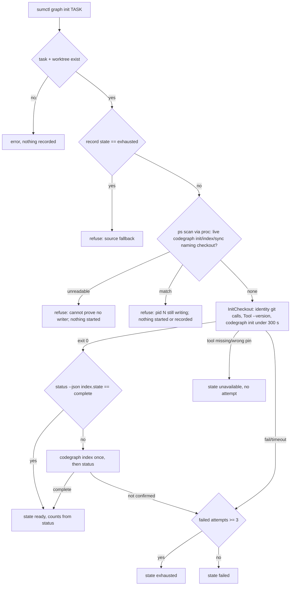

# Demand-driven Codegraph with bounded indexing - Plan

## Goal Capsule

- **Objective:** Creating a task, development, or verification checkout never waits on, runs, or depends on Codegraph. A coordinator who wants an index asks for one explicitly and gets a bounded, truthful outcome that never shares an index between checkouts or starts a second writer on one.
- **Means:** Delete the three automatic `graph.InitCheckout` calls. Treat the absent graph record as the honest "not built" state. Harden the one explicit path (`sumctl graph init TASK_ID`) with a live-writer admission check, the documented three-failure bound, and capped diagnostics, all on `go/internal/proc`. Then reconcile every doc, skill, and feature-map row that promises eager indexing, build slots, or `deferred` (KTD1-KTD6).
- **Authority:** Issue #203, then this plan, then `VERIFY.md` and the feature maps.
- **Stop:** No daemon, scheduler, build-slot pool, eager/lazy/auto mode flag, global install, shared cache, process kill, or second runner. Do not change project verification contracts, worker/coordinator verification, or independent review.
- **Execution profile:** Standard Go change with unit and CLI tests plus the canonical verifier. Before/after measurements come from isolated fixtures and the Go binary.
- **Who finishes:** The implementer lands, verifies, opens the PR, and (granted for this run) squash-merges after CI is green.

---

## Product Contract

### Summary

`prepare`/`dispatch`, `dev prepare`, and `verify --execute` stop calling Codegraph. A task without `graph.json` is "not built", and the brief, `context --section execution`, `graph status`, and `doctor` say so plainly. `graph init TASK_ID` stays the one explicit indexing path. It refuses to start while a Codegraph writer is still live for that checkout, records `exhausted` after three failed attempts, and keeps error text bounded.

### Problem Frame

Every task dispatch, development checkout, and coordinator verification run currently indexes its checkout before returning.
Indexing is optional exploration help, yet it sits on the critical path.
A slow, missing, or hung Codegraph adds up to the 300 s bound to each dispatch and each verification before the verification runner is even checked.
Every checkout also gets a `.codegraph/` index whether anyone queries it or not.
#214 bounded the subprocesses but left two gaps.
First, a timed-out `codegraph init` stops only the launcher, so an immediate retry could start a second indexer on the same index.
Second, the docs describe build slots, `deferred`, and a three-failure `exhausted` bound that the Go port never implemented.

### Requirements

**Ordinary paths**

- R1. `prepare`/`dispatch`, `dev prepare`, and `verify --execute` invoke Codegraph zero times: no `--version`, `init`, or `status`.
- R2. A missing or never-exiting Codegraph cannot delay or fail those paths.
- R3. `verify --execute` checks for the project's verification runner before anything else in its detached checkout. A project whose own verification contract runs Codegraph keeps doing so, because that runs inside the project's command.

**Honest state**

- R4. A task with no graph record is reported as "not built": no index exists, `graph init TASK_ID` builds one on request, and the source is the fallback. It is never labeled `failed` or `ready`.
- R5. Existing records from earlier releases (`ready`, `failed`, `unavailable`) keep reading exactly as before.

**Explicit path**

- R6. `graph init TASK_ID` refuses to start, and records nothing, when a live process for that checkout is a Codegraph writer (`init`, `index`, or `sync` naming the checkout path). It also refuses when the process table cannot be read.
- R7. The third failed attempt on a task records `exhausted`; a later `graph init` is refused with the source fallback. `unavailable` is not an attempt and never counts.
- R8. Init and status stay bounded by `proc.RunContext`: 300 s init (`SUM_GRAPH_TIMEOUT`), 60 s status and `--version`, capped stdout/stderr. A recorded error is at most a few KB. Truncated or incomplete status JSON is never a live status.
- R8a. `ready` is recorded only when a bounded `status --json` after the build reports `initialized: true` and `index.state == "complete"`. An index an interrupted build left behind (which a real `init` retry skips with exit 0) gets one `codegraph index` rebuild, and if that is not confirmed complete the attempt is `failed`.
- R9. The index stays inside its own checkout (`<checkout>/.codegraph`) after identity validation, with the pinned tool only, `CODEGRAPH_NO_DAEMON=1`, and `CODEGRAPH_NO_DOWNLOAD=1`. Two task checkouts get two separate indexes. A repeated `graph init` on a ready index is a cheap re-run that stays `ready`.
- R10. A graph outcome never starts a worker, changes capacity or reservations, or counts as verification evidence.

**Documentation**

- R11. `AGENTS.md`, skills, `docs/DEPENDENCIES.md`, `docs/architecture.md`, `docs/ACCEPTANCE.md`, `ATTRIBUTIONS.md`, help text, and `docs/features/graph.md` describe on-demand indexing and only the states the code writes. Every feature-map row cites a test that actually asserts it.

### Success Criteria

- Isolated before/after runs of the current Go binary show the Codegraph call count on dispatch, dev prepare, and verify dropping to zero, and report measured startup latency with the normal fake and with a never-exiting fake.
- The canonical verifier passes on the candidate.

### Scope Boundaries

- `graph init` does only the reconciliation R8a needs (confirm with `status`, rebuild an incomplete index once with `index`). It does no `sync` of a complete-but-stale index and no version or extraction-schema migration; `graph status` reports staleness and the worker syncs.
- No new flag or mode on `dispatch`, `dev prepare`, or `verify`.
- No automatic graph for development checkouts. A developer who wants one runs the pinned binary on their own checkout (documented in `skills/sum-develop/SKILL.md`), because `graph init` is a coordinator command over task records.

### Deferred to Follow-Up Work

- The ready-state brief prints the same `query NAME` command under the `explore`, `query`, `node`, and `affected` labels (`go/internal/graph/init.go`). This is a pre-existing cosmetic defect, recorded in the PR.
- The historical `docs/VALIDATION.md` Python-era graph slice stays as dated history, with a one-line pointer to the current behavior.
- Argv matching splits `ps` output on whitespace, like `ProcessesBoundTo` already does, so a checkout path containing spaces is not matched. This is a pre-existing limitation of that helper.
- Admission is a check followed by a start, not an atomic claim. A writer that starts between the `ps` scan and the `codegraph init` spawn (a window of identity git calls plus `--version`) is not refused.

---

## Planning Contract

### Key Technical Decisions

- **KTD1. All graph subprocesses stay on `go/internal/proc`.** The admission scan reads `ps` through the existing runner. (session-settled: user-directed — chosen over a graph-specific or second runner: issue boundary and #214 made proc the single runner.)
- **KTD2. "Not built" is the absence of `graph.json`, not a new state value.** Absence is already a state every reader handles (`graphview.Read` returns nil; the brief, context, status, backup, and rundown all branch on it). Only its wording claimed "dispatched before sum initialized graphs", and that wording changes. This is the smallest compatible change, and it writes nothing at prepare time.
- **KTD3. Retry admission comes from the live process table, not from a lock or a timestamp.** The lab run of the real 1.5.0 binary settles this. An inherited lock fd reaches only the npm shim: libuv's `spawnSync` closes it for the bundled indexer, which is exactly the process that outlives a launcher timeout. That indexer's argv does carry `init <checkout>`. So `graph init` scans `ps -ax -ww -o pid=,args=` (through proc, bounded; `-ww` because procps truncates `args` to `$COLUMNS` even when piped, measured 40 vs 2356 characters). A writer is a process with an argv field whose basename, minus any extension, is `codegraph` (this covers `.local/bin/codegraph`, the bundle's `lib/dist/bin/codegraph.js`, and the `codegraph.py` fake). The next non-flag field after it must be `init`, `index`, or `sync`, and a later field must be the checkout or a path inside it. The recorded tool path is deliberately not used, because the real indexer's argv never contains it. `graph init` refuses on a match or on an unreadable table. No PID is recorded or signaled. (session-settled: user-directed — chosen over kill-based cleanup of the stray indexer: issue boundaries.)
- **KTD4. Implement the documented three-failure `exhausted` bound; remove build slots and `deferred`.** `InitTask` already refuses `exhausted` and `CLAUDE.md`/`AGENTS.md` already promise "retries within the bound", so a failure count finishes an existing contract in a few lines. Build slots bounded eager concurrency across twelve dispatches. With indexing explicit and per-checkout admission in place, they have nothing to bound, and adding them would invent a mode. (session-settled: user-directed — chosen over adding new indexing modes or a scheduler/daemon: issue scope item 5.)
- **KTD5. Recorded init errors reuse proc's bounded error text.** `runCodegraph` currently replaces proc's error with the raw `Result.Detail()`, which can be up to 8 MiB of free-text stdout written into `graph.json`. Returning proc's error as-is keeps a bounded diagnostic (the stderr tail, or a bounded slice of the stdout head when stderr is blank; capped at 4000 bytes) and deletes the rewrite.
- **KTD7. `ready` means Codegraph confirmed a complete index.** In the lab, the real 1.5.0 `init` creates `.codegraph/codegraph.db` before indexing. A retried `init` on that file exits 0 ("Use codegraph index to re-index") whether or not the first build finished. Only `status --json` `index.state` tells them apart. After a zero exit, `InitCheckout` runs the existing bounded `observeStatus` once and fills `index` counts from it. `complete` becomes `ready`. Any other state gets one `codegraph index` and one more status check. Anything still unconfirmed becomes a `failed` attempt that counts toward KTD4. The fake learns `FAKE_CODEGRAPH_PARTIAL` (the build leaves `index.state: "indexing"` and exits 1) so tests reproduce this.
- **KTD6. The shared process-table helper is extracted, not duplicated.** The argv half of `proc.ProcessesBoundTo` becomes a small exported `proc` function that returns the pid and argv fields of processes whose argv names a path inside a checkout. `ProcessesBoundTo` reuses it with unchanged behavior, and graph filters its result.

### High-Level Technical Design

Prepare, dev prepare, and verify no longer enter this graph at all.

### Assumptions

- Headless run: no scoping confirmation was possible. These bets are recorded here and in the PR body.
- A dev checkout's existing `graph` field in `.sum/dev.json` (from an earlier release) is left untouched as history. The `dev prepare` result no longer carries `graph`.
- `graph status` on a task with no record keeps returning `recorded: null, live: null`, with a note that nothing was built.

### Sequencing

U1 (remove eager calls) → U2 (honest wording) → U3 (explicit-path hardening, with the proc extraction) → U4 (CLI coverage of the explicit path) → U5 (docs and maps) → U6 (measurements, recorded in the PR).

---

## Implementation Units

### U1. Remove automatic indexing from ordinary paths

**Goal:** Prepare/dispatch, dev prepare, and verify execute never call Codegraph.
**Requirements:** R1, R2, R3, R10.
**Dependencies:** none.
**Files:** `go/internal/prepare/prepare.go`, `go/internal/devcmd/dev.go`, `go/internal/verifycmd/execute.go`, `go/internal/cli/demo_test.go`, `go/internal/cli/verify_execute_test.go`, and a new CLI test for the never-exiting fake (in `go/internal/cli/graph_test.go` or a new `graph_demand_test.go`).
**Approach:**
1. prepare: delete the `InitCheckout`/`WriteTaskGraph` block and drop `graph` from the key-copy list so no `graph: null` is written.
2. devcmd: delete the graph call and the `graph` result field; extend the note with the not-built/fallback sentence.
3. verifycmd: delete the graph init and `parsed.Set("graph", …)`, so the runner-presence check is the first step after the checkout exists.
**Patterns to follow:** existing lab helpers `demoLab`, `newVerifyLab`, and the fake's `calls.jsonl` log (`tests/fixtures/codegraph.py`).
**Test scenarios:**
- The offline demo dispatch returns a task with no `graph` key and adds no entries to `FAKE_CODEGRAPH_ROOT/calls.jsonl` (count the lines before and after `dispatch`, because `doctor` earlier in the demo legitimately logs `--version`). The worktree has no `.codegraph/` and a clean `git status`.
- With `SUM_CODEGRAPH_BIN` pointing to a script that sleeps forever for every argument (including `--version`), `dispatch` finishes well under the graph bound and records no graph.
- `verify --execute` evidence has no `graph`, the verification checkout never gets a `.codegraph/`, the fake logs zero calls, and the worker checkout is untouched.
- `verify --execute` against a candidate with no runner still fails with the not-standardized message, now without any graph work first (existing test keeps passing).
- `dev prepare` in a lab, if the harness supports it cheaply: the result has no `graph` key and the fake logs zero calls. Otherwise dev.go no longer imports `graph`, which proves the zero-call property structurally, and the feature-map row says which.
**Verification:** The changed tests pass, and `grep` finds `graph.InitCheckout` only in `graph.InitTask`.

### U2. Honest "not built" wording

**Goal:** Every surface that reads a missing record says "not built; `graph init` builds one on request; read the source".
**Requirements:** R4, R5.
**Dependencies:** U1.
**Files:** `go/internal/graphview/graphview.go`, `go/internal/brief/regenerate.go`, `go/internal/graph/init.go` (status note), `go/internal/doctor/doctor.go`, `go/internal/helpview/catalog.json`, and affected goldens under `go/internal/cli/testdata/` (context no-record sections, help).
**Approach:** Change the nil-record note in `graphview.View`. Rewrite the brief's nil branch to state not built and point at the coordinator's `graph init` and `context --section execution`, while keeping the "do not run `codegraph init` yourself" line and the shared assist-only and no-install lines. Change the doctor detail to "builds a checkout-local index on request". Make the help text say indexing is on request. Regenerate the pinned goldens and review each diff.
**Test scenarios:**
- A context execution section for a task with no record carries the new note (golden).
- A brief rendered for a fresh dispatch contains "not built" and the `graph init` command, and does not claim `ready` or `failed`. Assert on the brief file in the demo lab.
- An existing ready-record golden is unchanged (R5).
**Verification:** The golden diffs show only the wording change.

### U3. Harden the explicit path

**Goal:** `graph init` admits one writer per checkout, bounds retries, and keeps diagnostics bounded.
**Requirements:** R6, R7, R8, R9, R10.
**Dependencies:** U1.
**Files:** `go/internal/proc/inspect.go`, `go/internal/proc/proc_test.go` or a new inspect test, `go/internal/graph/init.go`, `go/internal/graph/init_test.go`.
**Approach:**
1. Extract the ps/argv half of `ProcessesBoundTo` into an exported proc helper that returns pid and argv, and have `ProcessesBoundTo` reuse it (KTD6).
2. In `InitTask`, after the exhausted check and before `InitCheckout`, call a graph-local filter over that helper for writer processes. Refuse with a message naming the pid(s), that nothing was started or recorded, and that `graph status` observes. Refuse likewise when the scan errors (KTD3).
3. In `InitCheckout`, after a zero-exit build, confirm with `observeStatus` and rebuild an incomplete index once with `index` (KTD7).
4. After appending a failed attempt, set `exhausted` instead of `failed` once failed attempts reach three (KTD4).
5. `runCodegraph` returns proc's error unchanged (KTD5).
6. Extend `tests/fixtures/codegraph.py` with `FAKE_CODEGRAPH_PARTIAL`, and have status report the recorded `index.state`.
**Patterns to follow:** `ProcessesBoundTo` pid/self/exclude handling; `appendAttempt`; `graphview` failure counting.
**Test scenarios:**
- A live fake writer process (`<fake codegraph> init <repo>` sleeping) makes `InitTask`-level admission refuse, without running the fake's `init` again and without changing `graph.json`.
- A live process that names the checkout but is not a Codegraph writer (for example `sleep` with the path as argv, or `codegraph serve --path <checkout>`) does not block.
- Three consecutive failing inits produce states `failed`, `failed`, `exhausted`; a fourth `InitTask` is refused with the exhausted message.
- An `unavailable` outcome records no attempt and never exhausts.
- A failing init that writes more than 8 MiB to stdout and then its final failure line to stderr records an attempt error of at most about 4 KB that contains that stderr line.
- A failing init that writes more than 8 MiB to stdout only records `failed` with an error of at most about 4 KB.
- A zero-exit init whose status reports `index.state: "indexing"` triggers exactly one `index` call. When the rebuild completes the state is `ready`; when status still is not complete it is `failed`. It is never `ready` from the partial index.
- A zero-exit init whose status output is not JSON records `failed`, not `ready`.
- The writer filter matches the real 1.5.0 argv shape (`<bundle>/node --liftoff-only --disable-warning=ExperimentalWarning <bundle>/lib/dist/bin/codegraph.js init <checkout>`) and the fake shape (`/bin/sh <tmp>/codegraph init <checkout>`). It does not match `codegraph serve --mcp --path <checkout>`, `codegraph status --json <checkout>`, or an `init` naming a different path.
- The proc helper still returns a long-argv process when `COLUMNS=40` is in the environment.
- Existing timeout, held-descendant, incomplete-JSON, over-limit, and failing-status tests keep passing.
- The proc helper returns a spawned process whose argv names a path inside a temp dir, excludes self, and `ProcessesBoundTo` behavior is unchanged (existing cleanup tests pass).
**Verification:** The graph and proc package tests pass.

### U4. CLI coverage of the explicit path

**Goal:** Prove the acceptance items end to end through `sumctl` with the strict fake.
**Requirements:** R6, R7, R9, R10.
**Dependencies:** U1, U3.
**Files:** `go/internal/cli/graph_demand_test.go` (new), reusing `demoLab`.
**Test scenarios:**
- Dispatch two tasks in one repo. `graph init` on each yields `ready`, with `index_path` under each worktree and none in the primary clone. Each fake index lists its own checkout's files, and `git status --porcelain --untracked-files=all` stays clean in both.
- A repeated `graph init` stays `ready`, with attempts growing and no error.
- After an uncommitted edit, `graph status` reports freshness `stale`.
- With `SUM_CODEGRAPH_BIN` missing, `graph init` records `unavailable`, and the task's status, reservations, and pane are unchanged.
- A dispatched task whose first `graph init` ran with `FAKE_CODEGRAPH_PARTIAL=1` (leaving an incomplete index) is not `ready`. The next `graph init` without it rebuilds through `index` and records `ready`.
- With `FAKE_CODEGRAPH_FAIL=1`, three `graph init` calls end `exhausted` and the fourth exits nonzero with the exhausted message. The task stays dispatched and no new pane appears in the fake Herdr.
**Verification:** New tests pass under `go test ./internal/cli`.

### U5. Documentation, skills, and feature maps

**Goal:** Every written promise matches the code.
**Requirements:** R11.
**Dependencies:** U1-U4.
**Files:** `AGENTS.md` (CLAUDE/GEMINI/GROK symlinks), `skills/sum-dispatch/SKILL.md`, `skills/sum-worker/SKILL.md`, `skills/sum-rundown/SKILL.md`, `skills/sum-develop/SKILL.md`, `skills/sum-delivery/SKILL.md`, `docs/DEPENDENCIES.md`, `docs/architecture.md`, `docs/ACCEPTANCE.md` §12, `docs/VALIDATION.md` (one pointer line), `ATTRIBUTIONS.md`, `docs/features/graph.md`, `tests/fixtures/codegraph.py` docstring (slot wording).
**Approach:** Replace the eager-indexing sentences with on-demand ones. Delete the build-slot/`deferred` promise and the status→index/sync reconciliation description. Keep `exhausted` with its now-real bound. Rewrite the feature map:
- Replace `graph.dispatch-init`, `graph.dev-prepare`, and `graph.root-verification` with zero-call rows.
- Delete `graph.deferred-slot` and `graph.twelve-workers`.
- Re-point `graph.two-worktrees`, `graph.repeat-init`, `graph.stale-honest`, `graph.excluded-trees`, `graph.failed-init`, and `graph.unavailable` at the U3/U4 tests that assert them, and add `graph.single-writer` and `graph.confirmed-ready` rows.
- Re-point `graph.no-global-writes` at `go/internal/cli/graph_config_test.go` and `go/internal/cli/graph_test.go`, and `graph.cleanup-backup-release` at `go/internal/cleanup/inspect_test.go` plus any existing release test that refuses a bundle with `.codegraph`. Trim any clause that no test asserts.
- Keep the manual rows.
Run `.agents/skills/maintain-verification` against the map and contract.
**Test expectation:** none; this unit is documentation. The verifier's map/contract checks and the feature-map drivers cover it.
**Verification:** `grep` for `deferred`, `build slot`, `initializes the index`, and `every checkout sum creates` finds no live promise. `verify_run.py --check` passes.

### U6. Before/after measurements

**Goal:** Report the real latency and subprocess counts that the acceptance requires.
**Requirements:** Success Criteria.
**Dependencies:** U1.
**Files:** scratch only (a temporary measurement test copied into a `git archive` of the base and into the candidate). Nothing is committed.
**Approach:** Build both binaries. For each, dispatch N tasks sequentially, run `dev prepare` if the lab supports it, and run one `verify --execute`, first with the fake Codegraph and then with a never-exiting fake (the base run uses `SUM_GRAPH_TIMEOUT` so it ends; note the 300 s default). Record wall times and `calls.jsonl` counts.
**Test expectation:** none; this is measurement.
**Verification:** A numbers table goes into the PR body.

---

## Verification Contract

- Iterate with `go test ./internal/graph ./internal/proc ./internal/cli/...` in `go/`.
- Final gate, run once: `MISE_ENABLE_TOOLS=go,python,node python3 .agents/skills/verify/scripts/verify_run.py --base "$(git merge-base origin/main HEAD)"`. Feature-map edits make it `requires_root_review`.
- Live Herdr and the real harness with MCP stay `not-run` unless genuinely exercised. The real Codegraph binary was exercised in a lab only for the KTD3 finding.

## Definition of Done

- U1-U5 are landed with passing tests, U6 numbers are in the PR body, the canonical verifier passes, the PR says "Closes #203", CI is green, and the PR is squash-merged.
- Residuals (the four-label `query` defect, space-in-path argv matching, the check-then-start admission window, the historical VALIDATION record) are listed in the PR body.
