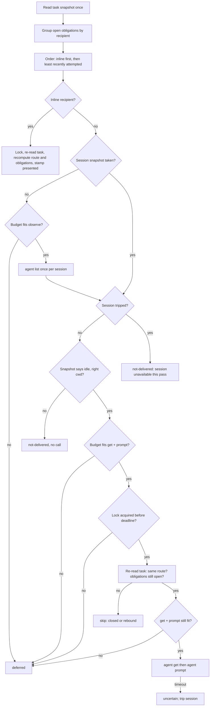

# Separate fast coordination and return delivery from PR reconciliation and cleanup - Plan

## Goal Capsule

- **Objective:** A coordinator can start a session, read its inbox, and receive or send saved returns in a predictable, documented amount of time regardless of how many tasks exist or whether GitHub or one Herdr pane is slow. PR observation, evidence publication, and cleanup happen only when the coordinator asks for them, and anything they have not done yet stays visible with the exact command that does it.
- **Means:** Three command classes with one boundary (KTD1): read-only views (`status`, `inbox`, their `--live` form), budgeted fast delivery (`init`, `pump`, `bind`, `notice`, task-write notices, hook events), and explicit maintenance (`pr reconcile`, `pipeline`, `cleanup`, and the former implicit sweep as an explicit `sweep`). The pump gets an overall pass budget, a per-operation Herdr snapshot, fair ordering, and revalidation before every write (KTD2-KTD5).
- **Authority:** Issue #206, then this plan, then `VERIFY.md` and the feature maps.
- **Stop:** No daemon, timer, scheduler, persistent cache, generic maintenance engine, second subprocess runner, approval bypass, automatic merge, or live installation update. Do not touch #207 (pane reuse/incarnation), #209 (delivery-lock scope), or #210 (legacy notice mirrors). Preserve #202 machine identity and every cleanup/recovery safety rule.
- **Execution profile:** Deep, cross-cutting Go change with unit and CLI tests, doc/skill/feature-map reconciliation, measurements from fixtures against the built Go binary, and the canonical verifier.
- **Who finishes:** The implementer lands, verifies, opens the PR, and (granted for this run) squash-merges after CI is green.

---

## Product Contract

### Summary

Coordinator `init`, `bind`, `pump`, hook events, and `hook enable` stop running the lifecycle sweep, so they never call GitHub or apply cleanup. They deliver saved returns in one pass bounded by an explicit budget, report the recipients they deferred, and list outstanding maintenance with exact next commands. `status`/`inbox` stay read-only; `--live` adds one bounded Herdr observation per session and writes nothing. The former sweep is reachable as an explicit coordinator command, `sumctl sweep`, which is itself budgeted, fair, and reports deferred tasks.

### Problem Frame

`lifecycle.PumpAndSweep` runs `returns.Pump` and then `Sweep`, which reconciles every recorded open PR through `prcmd.Reconcile` (several `gh` calls, a possible PR-body edit, evidence uploads) and applies every pending cleanup (Herdr, git, `ps`, `lsof`, process signals, workspace removal). Coordinator `init`, `bind`, `pump`, `hook enable`, and every coordinator-idle or worker exit/close hook event call it. Establishing a session therefore waits for maintenance on every task, and a slow `gh` stalls it for many multiples of the 120-second bound each `gh` call carries (`prcmd.ghBound`, `pipeline.defaultGhBound`; one `pr reconcile` makes two such calls before a hung observation fails).

The pump itself has no overall budget: it visits recipients in Go map order (unfair), spends an `agent get` plus `agent prompt` (5 s each) per recipient, runs `git rev-parse` per delivery, and delivers from task records read at the start of the pass without re-reading the route before the prompt.

Source inspection also shows the Go `status --live`/`inbox --live` only set `"live": true`; they observe nothing and deliver nothing, while `CLAUDE.md`, `skills/sum-rundown/SKILL.md`, `docs/architecture.md`, `docs/herdr-backend.md`, `docs/recovery.md`, and `docs/configuration.md` describe the Python-era behavior (one snapshot per session, a delivery pass, `cleanup_reconciled`, hook reconciliation, `fanout`). The help catalog lists `inbox` as read-only and the developer guard allows it against installation state. Docs and callers must agree.

### Requirements

- R1. `init` (any role), `status`, `inbox`, `status --live`, `inbox --live`, `bind`, `pump`, `notice`, task-write notices, `hook enable`, and hook events never run `gh`, never publish evidence or pipeline blocks, and never inspect or apply cleanup.
- R2. `status`, `inbox`, and their `--live` form write nothing under the state home. `--live` adds one bounded `agent list` per Herdr session of the local active tasks and reports each task's observed agent state from it; without a usable Herdr context it says so and stays a records view.
- R3. Every fast delivery pass has one overall time budget (documented default, `pump --budget` to override). The delivery lock is acquired with a wait bounded by the remaining budget, and no Herdr call starts unless, with the lock held, its own timeout plus `proc.PipeGrace` fits the remaining budget. A started call is never cut by the pass deadline and no prompt becomes `uncertain` because of the budget. One hook event shares one budget across every pump it runs.
- R4. A recipient the pass did not reach because the budget ran out or the delivery lock stayed busy is reported `deferred` with a reason, gets no delivery record, and stays pending; it is never reported submitted or not-delivered.
- R5. Recipients are visited in a deterministic fair order (inline recipient first, then least recently attempted), so repeated explicit passes reach recipients a previous pass deferred.
- R6. One Herdr snapshot per session per operation is reused for recipient selection. A session whose Herdr call failed, timed out, or had an unknown effect trips: it gets no further calls in that pass, and each of its later recipients is stamped `not-delivered` (session unavailable this pass), so it sorts behind healthy sessions next pass and reaches `stalled` after the existing attempts bound.
- R7. Immediately before a delivery write (a prompt or an inline "presented" stamp) the pass re-reads the task, recomputes the route and open obligations, and re-observes the recipient; an obligation closed since the snapshot is not stamped, and a route rebound since the snapshot receives nothing.
- R8. `init`, `pump`, `status`, `inbox`, and `sweep` expose a `maintenance` view from local records: recorded open PRs with the time they were last observed and `sumctl pr reconcile TASK`, cleanup pending/blocked/removing with blocker codes and `sumctl cleanup TASK`, and a one-line summary naming `sumctl sweep`. Nothing in that view is re-stamped or claimed current.
- R9. `sumctl sweep [--task ID]... [--budget SECONDS]` is coordinator-only, runs one PR observation per recorded open PR and one cleanup apply per pending task (the former implicit behavior), starts no task after its budget, orders tasks least-recently-maintained first, stops PR observations for the pass after a `gh` timeout, re-reads each task before acting, and reports `deferred` tasks with their next command. Its budget bounds admission only: one started task can overrun it by its helpers' own bounds, and the docs say so.
- R10. Explicit `pr reconcile`, `pipeline`, `cleanup`, and `sweep` keep their current idempotence, exact-identity checks, retained evidence, intent reconciliation, and safe stops.
- R11. Delivery pass output carries `fanout`: sessions, Herdr calls, elapsed and budget milliseconds, and deferred count.
- R12. CLI help, `CLAUDE.md`/`AGENTS.md`, role skills, architecture/backend/recovery/configuration docs, and feature maps describe the actual read-vs-delivery-vs-maintenance boundary and the intentional default change.
- R13. Measurements of the current Go executable (p50/p95 wall time, task reads, subprocess, Herdr, and `gh` calls) for 1, 12, and 100 fixture tasks with mixed active/archived tasks and a slow dependency are recorded separately from the historical Python benchmark.

### Key Decisions

- **Maintenance leaves every implicit path, including hook events.** The hook is delivery, not maintenance; a coordinator-idle edge must not wait on GitHub. Governs R1, R9.
- **`inbox --live` stays read-only.** The help catalog and developer guard already treat `inbox` as read-only; docs that promise a delivery pass there are corrected rather than the command turned into a writer. Governs R2, R12.
- **The batch sweep survives as an explicit command** so #194's merged-task recovery keeps a one-command path. The coordinator runs it (or `pr reconcile TASK`) when the user says a PR merged or asks about PR state; a rundown never calls GitHub and reports recorded open PRs with their last observation time. Governs R8, R9.

### Success Criteria

- Fake-`gh` call logs are empty across coordinator `init`, `status`, `inbox`, `--live`, `pump`, `bind`, and hook events with open PRs and merged tasks present; the same logs show `sweep` and `pr reconcile` calling `gh`.
- With a hung Herdr observation or prompt, `init` and `pump` finish within the documented budget plus local overhead and report deferred recipients.
- Measurements table in the PR body and `benchmarks/issue-206/report.md`.

### Scope Boundaries

- Not changing how `ask`/`answer`/`report` trigger their single-task notice beyond the shared budget and revalidation.
- Not threading a context through `prcmd`, `pipeline`, `evidence`, or `cleanup`; `sweep` bounds by starting no new task after its budget.
- Not creating attention records from `--live` snapshots, not reconciling `removing` cleanups from `inbox` (that is `cleanup TASK`), and not reintroducing hook reconciliation into `inbox`.

### Deferred to Follow-Up Work

- Context-aware `prcmd.Reconcile`/`cleanup.Run` so a single maintenance task can be cut by a budget.
- #207 pane-reuse identity, #209 delivery-lock scope, #210 legacy `notice` mirrors.

---

## Planning Contract

### Key Technical Decisions

- KTD1. **Three command classes, one boundary.** Read-only views never write; fast delivery writes only delivery records, notice mirrors, refresh delivery rows, and registrations; maintenance is explicit. `lifecycle.PumpAndSweep` is deleted and every caller calls the pump directly. The historical sweep feature row is rewritten, not silently dropped.
- KTD2. **Budget as a caller context with admission per call, after the lock.** The pump creates one deadline for the pass (or inherits a caller's, as a hook event does for all its pumps). The delivery lock is taken with a wait bounded by that deadline (non-blocking `flock` retried until the deadline; the lock's scope is unchanged, #209). With the lock held and the task re-read, each Herdr call is admitted only when remaining time ≥ its own timeout + `proc.PipeGrace`, and it runs with that timeout, so a started call is never cut by the pass deadline. Defaults: 15 s pass, 5 s per observation, 5 s per prompt. (Rejected: multiplying per-call timeouts by recipients; cutting calls at the deadline, which would turn prompts `uncertain`; admission before the lock, which a concurrent pass holding the lock would invalidate.)
- KTD3. **One shared snapshot type in `herdrclient`.** The refresh command's per-session `agent list` snapshot moves into `herdrclient` with caller-context support and is used by refresh, the pump, and `--live`. `herdrclient` gains context-taking variants; existing signatures remain thin wrappers so unrelated callers do not churn. (session-settled: user-directed — chosen over adding another runner or pump: #208 consolidated subprocess execution on `proc.RunContext`.)
- KTD4. **Snapshot selects, fresh reads authorize.** Snapshot-busy, absent, or wrong-cwd recipients are `not-delivered` without further calls (same meaning as today's `agent get` result). A snapshot-idle recipient gets a fresh `agent get` immediately before `agent prompt`. Under the delivery lock the task is re-read and the route and obligations recomputed before anything is stamped. (session-settled: user-directed — chosen over a persistent task/Herdr cache: a snapshot is not mutation authority.)
- KTD5. **Fairness from records, not a scheduler.** Recipient order is inline first, then the oldest last delivery attempt across its items (never-attempted first), then recipient key. A deferred recipient gains no new attempt record, so it sorts ahead next pass. `sweep` orders by the older of the PR observation and cleanup record times. (session-settled: user-directed — chosen over a background ticker: sum stays synchronous and daemonless.)
- KTD6. **Maintenance view is pure over records.** `lifecycle.Pending(host, tasks)` builds rows from the same task snapshot the command already read, reusing `cleanup.Pending`; it adds no reads and no writes.
- KTD7. **Measurements run the built binary against fixture homes.** A Go test gated by an environment variable plants 1/12/100-task homes in-process, runs the candidate (and optionally a base) `sumctl` as a subprocess, counts Herdr and `gh` calls from the fakes' logs and task reads and subprocess starts from `strace`, and writes raw JSON plus a markdown report. The historical Python benchmark in `benchmarks/issue-37/` is untouched.
- KTD8. **#202 identity preserved.** All host comparisons keep `machine.Identity.Is`/`Canonical` and `routeKeys` legacy aliases.

### High-Level Technical Design

Command classes:

| Class | Commands | May write | External calls |
| --- | --- | --- | --- |
| Read-only view | `status`, `inbox`, `--live`, `show`, `context`, `doctor` | nothing | `--live`: one `agent list` per session |
| Fast delivery | `init`, `pump`, `bind`, `notice`, ask/answer/report notices, `hook enable`, hook events | delivery records, notice mirror, refresh delivery rows, registration | Herdr only, inside the pass budget |
| Maintenance | `pr reconcile`, `pipeline *`, `cleanup [--apply]`, `sweep` | PR records, PR body blocks, cleanup/archive | `gh`, Herdr, git, `ps`, `lsof` |

Pump pass (directional):

### Assumptions

- Default pass budget 15 s is reasonable for real Herdr (single-digit milliseconds per call) and bounds the slow Herdr cases; the 60 s sweep budget bounds admission only. Both are documented and overridable on the explicit commands.
- A failed, timed-out, or unknown-effect Herdr call trips its session; that session's recipients are `not-delivered` (a known observation failure, today's `agent get` meaning). Only budget exhaustion and a busy delivery lock are `deferred`.
- The shared Python Herdr fake accepts one session, so multi-session trip and fairness scenarios are proven in `returns` unit tests with shell fakes; CLI and measurement fixtures use one session.
- `--live` reports observed agent state per active task but creates no attention records.
- Measurement fixtures are synthesized records (not dispatched workers) so 100 tasks are cheap to plant; they exercise the same read and delivery paths.

### Sequencing

U1 then U2 (pump depends on the snapshot), then U3 (boundary and sweep), then U4 (`--live`, which attaches U3's maintenance view); each unit's tests land with it; U5 docs after behavior settles; U6 measurements last on the final binary.

---

## Implementation Units

### U1. Caller context and shared Herdr snapshot

**Goal:** `herdrclient` accepts a caller context and owns the per-operation session snapshot.

**Requirements:** R3, R6, R11; KTD2, KTD3.

**Dependencies:** none.

**Files:** `go/internal/herdrclient/herdrclient.go`, `go/internal/herdrclient/snapshot.go` (new), `go/internal/herdrclient/herdrclient_test.go`, `go/internal/refreshcmd/refresh.go`.

**Approach:**
1. Context-taking variants of the run/observe/call functions pass the caller context to `proc.RunContext`; existing functions call them with `context.Background()`.
2. A `Snapshot` type: lazy herdr path lookup, one `agent list` per session, `Agent(session, pane)` with the refresh fallback `agent get` when the list lacks a cwd, a counted `Call` for other Herdr calls in the same operation, per-session trip state, and a summary.
3. Refresh uses it with its current 10 s timeouts and its current summary fields.

**Patterns to follow:** `refreshcmd` `snapshots`; `proc.RunContext` classification.

**Test scenarios:**
- A caller context that is already past its deadline makes a Herdr call fail as not-started or uncertain without running the full per-call timeout.
- Two `Agent` lookups in one session cost one `agent list`.
- An agent absent from the list reads as `agent_not_found`.
- Refresh fleet counts (`herdr_calls` 1 for twelve workers) are unchanged.

**Verification:** herdrclient and refresh/fleet tests pass unchanged in meaning.

### U2. Budgeted, fair, revalidating pump

**Goal:** One delivery pass is bounded, fair, and never writes from a stale snapshot.

**Requirements:** R3-R7, R11; KTD2, KTD4, KTD5, KTD8.

**Dependencies:** U1.

**Files:** `go/internal/returns/pump.go`, `go/internal/returns/pump_test.go`, `go/internal/returns/pass_test.go` (new), `go/internal/store/store.go` (bounded delivery-lock acquisition), `go/internal/store/store_test.go`.

**Approach:**
1. `PumpOpts` gains a budget, an optional parent context, and an optional task snapshot; the pass creates one deadline and one `herdrclient.Snapshot`.
2. Buckets are sorted per KTD5.
3. Inline recipients follow the current path after a fresh re-read under the delivery lock.
4. Other recipients follow the flowchart: snapshot-based preselection, delivery lock with a deadline-bounded wait, fresh re-read and route/obligation recomputation, budget admission with the lock held, fresh `agent get` plus registration/owner checks, then the prompt. A failed or timed-out call trips the session (R6).
5. `runtimeSHA` is computed once per pass.
6. Result rows add `deferred` recipients with reason; the result adds `fanout`.

**Execution note:** Start with the stale-snapshot and slow-Herdr tests; they pin the safety contract before the refactor.

**Test scenarios:**
- Twelve worker recipients in one busy session cost one `agent list` and no prompts; each is `not-delivered` with the busy reason.
- An idle worker recipient gets `agent list`, `agent get`, `agent prompt` and is `submitted`.
- A hung observation: the session trips after one timeout, every recipient in that session is `not-delivered` (session unavailable), and the pass ends within budget.
- A hung prompt: that prompt is `uncertain`, the session trips, later recipients in that session are `not-delivered`, and the pass ends within budget.
- Two sessions, one whose `agent list` hangs: by the second consecutive pass the idle recipient in the healthy session is `submitted`.
- A second process holds the delivery lock for longer than the budget: the pass defers the recipient with reason `delivery lock busy`, starts no prompt, and returns within budget.
- A budget smaller than one prompt allowance defers every non-inline recipient and still presents the inline one.
- Fairness: with a budget that admits one recipient, two passes reach two different recipients.
- Stale snapshot, rebound worker: the task's pane changes after the snapshot; the old pane receives no prompt and nothing is stamped for it.
- Stale snapshot, closed obligation: the question is resolved after the snapshot; no delivery record names it.
- Inline delivery for the calling coordinator still presents its returns with no Herdr call.

**Verification:** returns tests pass; fake Herdr logs match the scenarios.

### U3. Fast/maintenance boundary and explicit sweep

**Goal:** No implicit path runs maintenance; maintenance stays visible and has one explicit batch command.

**Requirements:** R1, R8, R9, R10; KTD1, KTD5, KTD6.

**Dependencies:** U2.

**Files:** `go/internal/lifecycle/lifecycle.go`, `go/internal/lifecycle/lifecycle_test.go`, `go/internal/roleinit/designated.go`, `go/internal/bindcmd/bind.go`, `go/internal/hookstatus/enable.go`, `go/internal/hookstatus/event.go`, `go/internal/cli/native.go` (pump, sweep), `go/internal/cli/boundary_test.go` (new), `go/internal/prcmd/pr.go`, `go/internal/pipeline/publish.go`, `go/internal/helpview/catalog.json`.

**Approach:**
1. Delete `PumpAndSweep`; callers use `returns.Pump`, passing the task snapshot they already read (init reuses its under-lock read).
2. `lifecycle.Pending` builds the maintenance view (KTD6); `init` (coordinator), `pump`, and `sweep` attach it.
3. `lifecycle.Sweep` takes a budget and returns rows plus deferred rows; it orders candidates per KTD5, re-reads each task before acting, recomputes eligibility on the fresh record, and stops PR observations after a `gh` timeout or unknown effect.
4. `sumctl sweep` is registered (coordinator-only via `RequireCoordinator`) with `--task` and `--budget`; `pump` gains `--budget`.
5. Hook `startup`, coordinator-idle, and worker-edge handling keep their pumps and drop every sweep; the handler creates one deadline per event and passes it to every pump it runs.
6. `prcmd.ghBound` and `pipeline.defaultGhBound` become package variables tests can lower.

**Test scenarios:**
- Covers the fake-GitHub acceptance: a coordinator with one open-PR task and one merged cleanup-pending task runs `init`, `pump`, `bind --parent-only`, `status`, `inbox`, and `inbox --live`; the fake `gh` log stays empty and the task directories and fake Herdr workspaces are unchanged; `maintenance` names both tasks with `pr reconcile` and `cleanup` commands and the recorded observation times.
- Hook `startup`, coordinator-idle, worker exit, and worker close events, and `hook enable`, with the same fixture leave the `gh` log empty and apply no cleanup.
- `sweep` on the same fixture observes the open PR once and applies the merged task's cleanup, matching the old sweep rows; a second `sweep` is idempotent.
- `sweep` with a hanging `gh` (gh bounds lowered for the test, budget larger than one lowered observation): the first PR observation errors, later PR observations are `deferred` with `pr reconcile` commands, cleanup rows still run.
- `sweep --budget 0` defers every task and changes nothing.
- A task whose cleanup record changes to a newer execution between the snapshot and the action is re-read and not applied on stale eligibility.
- `sweep` from a developer pane is refused.

**Verification:** lifecycle and CLI tests pass; existing cleanup apply tests are untouched and green.

### U4. Read-only `--live`

**Goal:** `status --live`/`inbox --live` observe once per session and write nothing.

**Requirements:** R2, R8, R11; KTD3, KTD6.

**Dependencies:** U1, U3.

**Files:** `go/internal/statuscmd/statuscmd.go`, `go/internal/cli/status.go`, `go/internal/cli/status_test.go`.

**Approach:**
1. `Status` reuses the task it already read for the returns view instead of re-reading it, and attaches the maintenance view.
2. With `--live` and a resolvable Herdr context, one snapshot per session of local active tasks sets each row's `observed` (agent status, or `absent`, or `unobserved` with reason) and adds `fanout`; otherwise `live` is false with a reason.

**Test scenarios:**
- `--live` over twelve workers makes exactly one Herdr call and no `agent start`/`stop`.
- `--live` leaves every file under the state home byte-identical (hash before and after).
- A worker missing from the snapshot reads `absent` without its own lookup.
- Outside a Herdr context `--live` returns records with `live: false` and a reason.

**Verification:** status, fleet, and golden tests pass.

### U5. Documentation, help, skills, and feature maps

**Goal:** Every description matches the new boundary.

**Requirements:** R12.

**Dependencies:** U2-U4.

**Files:** `CLAUDE.md`, `AGENTS.md` (and any identical role instruction copies), `skills/sum-rundown/SKILL.md`, `skills/sum-delivery/SKILL.md`, `docs/architecture.md`, `docs/herdr-backend.md`, `docs/recovery.md`, `docs/configuration.md`, `docs/features/coordination.md`, `go/internal/helpview/catalog.json`.

**Approach:** State the three classes; replace promises that `inbox --live` delivers, reconciles cleanup, or runs hook reconciliation; document the pass budget, `deferred`, fairness, `maintenance`, `sweep` (admission-only budget), and the intentional default change; add `sweep` to the coordinator's named helper commands, run when the user says a PR merged or asks about PR state; have sum-rundown say `cleanup: pending` appears only after `sweep`, `pr reconcile`, or `cleanup` observed the merge, and that open-PR rows carry their last observation time; rewrite `returns.cleanup-sweep`; add a row for the fast-path boundary and budget. Run `maintain-verification` against the diff.

**Test expectation:** none -- documentation; covered by the operating-files and help-catalog tests that already run in the aggregate.

**Verification:** maintain-verification reports no unmapped behavior; the verifier's policy checks pass.

### U6. Measurements

**Goal:** Honest numbers for the current Go executable.

**Requirements:** R13; KTD7.

**Dependencies:** U2-U4.

**Files:** `go/internal/cli/coordination_measure_test.go` (new), `tests/fixtures/herdr.py` (observation-delay knob), `benchmarks/issue-206/report.md`, `benchmarks/issue-206/raw.json`.

**Approach:** Plant homes with 1/12/100 tasks (one third archived; active ones mixing open questions, unapplied answers, reports, open PRs, merged cleanup-pending), run `init`, `inbox --live`, `pump`, and `status` repeatedly against the candidate and a base build, with healthy fakes and with a slow Herdr observation and hanging `gh`. Record p50/p95 wall ms, and from one traced run per scenario the task reads, subprocess starts, Herdr calls, and `gh` calls. The test skips unless its output variable is set.

**Test expectation:** the gated measurement test itself; the always-on assertions live in U2-U4.

**Verification:** report written; numbers copied into the PR body.

---

## Verification Contract

- Targeted: `cd go && go test ./internal/herdrclient/... ./internal/store/... ./internal/returns/... ./internal/lifecycle/... ./internal/statuscmd/... ./internal/refreshcmd/... ./internal/roleinit/... ./internal/bindcmd/... ./internal/hookstatus/... ./internal/prcmd/... ./internal/cli/...`.
- Final, once: `MISE_ENABLE_TOOLS=go,python,node python3 .agents/skills/verify/scripts/verify_run.py --base "$(git merge-base origin/main HEAD)"` must pass. Live Herdr rows are `not-run` unless a real Herdr is available.
- Measurements: the gated test in U6 with its output variable set.

## Definition of Done

- R1-R11 hold with tests named in U1-U4; R12 holds per U5's verification; R13 holds per U6's report.
- No `PumpAndSweep`, no sweep call on any implicit path, no second runner or snapshot implementation.
- Docs, help, skills, and feature maps agree with the callers.
- Measurements recorded in `benchmarks/issue-206/` and the PR body.
- Abandoned-attempt code removed; the canonical verifier passes; PR merged after green CI.
