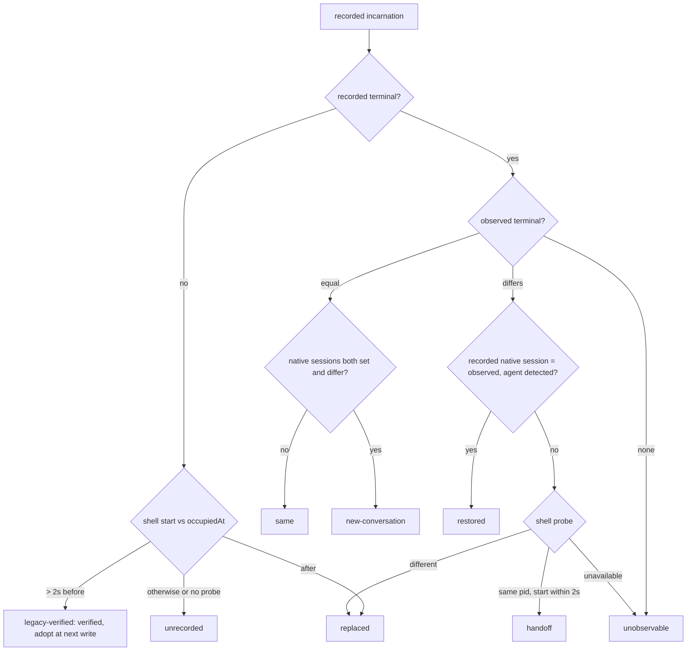
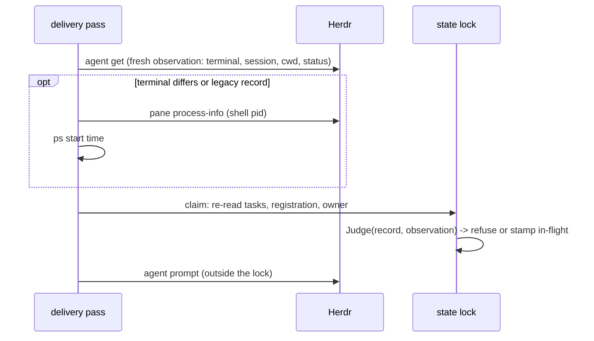

# Pane incarnation binding for roles and delivery - Plan

## Goal Capsule

- **Objective:** After Herdr restarts or hands a pane ID to a different occupant, nobody inherits the old coordinator or worker authority and no saved return is prompted into the wrong occupant. A pane that really is the same occupant (ordinary init, hostname change, live handoff, native conversation restore) keeps working without ceremony, and every refusal names why and which deliberate command recovers.
- **Means:** Record the Herdr terminal, native agent session, and shell process identity observed when a pane is bound (KTD1, KTD2), judge every later use through one comparator with distinct outcomes (KTD3), call it from every role, CLI, bridge, and delivery boundary including the #217 claim (KTD4, KTD5), and keep legacy records honest with a per-record proof instead of a bulk mark (KTD6).
- **Authority:** Issue #207, then this plan, then `VERIFY.md` and the feature maps.
- **Stop:** No invented backend generation field, no automatic failover, forced restart, cwd-derived authority, replay of uncertain work, replacement writer, or native-resume engine. Keep #202's stable machine identity and its alias tests. Do not touch #210 (legacy notice mirrors). No second identity service or subprocess runner.
- **Execution profile:** Deep Go change across `go/internal/{incarnation (new), store, roleinit, app, returns, repair, refreshcmd, bindcmd, prepare, herdrbridge, mesh, environment}`, proven with fake-Herdr regressions, plus one bounded real-Herdr lab scenario in `scripts/live_smoke.py`, docs, help, feature maps, and the canonical verifier.
- **Who finishes:** The implementer lands, verifies, opens the PR, and (granted for this run) squash-merges after CI is green.

---

## Product Contract

### Summary

A Herdr address (machine, session, pane ID) is reusable; the occupant behind it is not. sum now records what occupied the address when it was bound and checks that the same occupant is still there before it grants a role, runs a coordinator command, lets the bridge or MCP mutate, or submits a prompt. Tasks, decisions, reservations, and delivery history never change because of a mismatch; only the stale authority or submission is refused.

### Problem Frame

Every identity check today compares machine, session, and pane strings (`store.Matches`, `host.SameEndpoint`, `checkIdentity` in `returns/pump.go`). The only occupant guard is a cwd comparison. A bounded lab run against the pinned Herdr 0.9.0 (isolated `sum-test-207-*` sessions) established:

| Event | `pane_id` | `terminal_id` | shell pid | `agent_session` |
| --- | --- | --- | --- | --- |
| Ordinary use | same | same | same | same |
| `server stop` then restart (layout restored) | **same** (`w1:p1`) | new | new | kept when set |
| `kill -9` then restart | restored panes keep IDs; unsaved panes vanish and their IDs are handed out again | new | new | kept when set |
| `server.live_handoff` (the `update --handoff` path) | same | **new** | **same process** | kept |
| New workspace after restart | reuses numbering (`w2:p1`) | new | new | none |

So a restored or recycled `w1:p1` carries an old registration, owner, or task route to a new shell. Herdr exposes no server generation. `terminal_id` changes on every server incarnation, including live handoff, so it alone would break a legitimate handoff. `agent_session` (`{agent, kind, source, value}`, the native conversation id from an official integration) survives restart and handoff. Herdr's default `resume_agents_on_restore = true` is the supported restore path. `agent prompt` has no precondition parameter.

### Requirements

**Binding**

- R1. When sum binds a pane (coordinator claim, reclaim, or upgrade; worker registration at launch or `bind --worker-pane`; any `init` registration), it records the observed incarnation: `terminal_id`, `agent_session` when reported, and the shell process identity (pid plus OS start time) when observable.
- R2. One comparator decides whether the current occupant of a recorded address is the recorded incarnation. Its outcomes are distinct and documented: `same`, `new-conversation`, `handoff`, `restored`, `legacy-verified`, `replaced`, `unrecorded`, `unobservable`.

**Authority and delivery**

- R3. A reused address under a new incarnation (`replaced`), an address whose incarnation cannot be established (`unobservable`), and a legacy record without proof (`unrecorded`) never gain coordinator or worker authority automatically. This holds for `init` role recognition (installation and worker checkouts), `RequireCoordinator` commands, and bridge and MCP mutations.
- R4. Return submission (prompt and inline), `repair send`, and refresh delivery judge the recipient's observed incarnation against its record immediately before the side effect. The delivery judgment runs inside the #217 state-locked claim against freshly re-read records, and a rebind or restart seen there refuses the submission.
- R5. A refusal changes no task, question, answer, reservation, or delivery history, and it never turns `submitted` or `uncertain` into retryable. A refused prompt is recorded exactly as an identity refusal is today (`not-delivered`, nothing sent). The refusal names the outcome, the evidence, and the deliberate recovery for that outcome: `init --reclaim` for a coordinator that is `replaced` or `absent`, closing the recorded pane (so Herdr reports `pane_not_found`) before reclaiming an `unrecorded` coordinator, `bind TASK --worker-pane PANE` for a worker, and rerunning once Herdr answers for `unobservable`. An init that can neither prove nor disprove the recorded occupant (`unobservable`, `unrecorded`) leaves that address's registration untouched.
- R6. `init --reclaim` accepts a recorded coordinator that is `absent` (`pane_not_found`) or `replaced` (a different terminal and shell and no matching native session) as verifiably gone. `unobservable`, `unrecorded`, and any verified outcome refuse reclaim.

**Stability**

- R7. The same verified incarnation is stable across ordinary `init` calls and hostname changes; all #202 alias and route tests stay green.
- R8. A new conversation in the same terminal keeps its role and is reported as `new-conversation`. Live handoff (identical shell process) is `handoff`, and native restore (identical recorded session, same agent detected) is `restored`. All three are verified. They refresh the judged record at the coordinator's next `init`, or at the next verified delivery or `repair send` to a worker (workers' own `init` in their checkout writes nothing).

**Compatibility and evidence**

- R9. A record without incarnation metadata is not a match. It is `legacy-verified` only when the pane's current shell provably started before the record's own occupancy timestamp. It is `replaced` when the shell provably started after that timestamp, and `unrecorded` otherwise. Adoption happens per record at its next write, never in bulk.
- R10. Foreign-machine routes, an unreachable backend, a stale socket, and a reused PID (same pid, different start time) are never identity proof.
- R11. A bounded real-Herdr lab scenario validates the fields and outcomes the pinned backend supports. What it cannot prove is reported as a gap with a narrow upstream requirement.
- R12. `VERIFY.md`, recovery and help text, and feature maps describe the new boundary, and they state plainly that role bookkeeping is not an OS security sandbox.

### Success Criteria

- A regression that restores `w1:p1` under a new terminal and shell fails on the base commit (the old owner is recognized, and the old route is prompted) and passes after the change.
- The live lab run shows `same` across repeated inits, `replaced` after a restart of a plain shell pane, a successful reclaim afterwards, and `handoff` across a live handoff.

### Scope Boundaries

- Mesh relay and handoff targets are caller-chosen agents, not sum records. Their authority is the caller's own verified registration; the target is not incarnation-bound.
- Attribution- or refusal-only address matches stay address-based: note attribution, environment `by`/`recorded_by` attribution (`environment.endpointRole`; `env start` never refuses on role), the worker-cannot-answer refusal in `ask.Answer`, reviewer binding in `review.Run`, and hook attention matching by pane. Each either refuses or labels; none grants authority, and delivery of what they record is checked.
- `prepare` prompts the pane it created in the same operation; its pre-prompt window is covered by the Herdr gap below, not by a second check.
- Execution park and the occupant key set stay unchanged. Park already holds capacity whenever an agent, a foreground process, or an owned checkout process is present, so a reused pane cannot free another attempt's reservation. A regression pins that.

### Deferred to Follow-Up Work

- Close the residual TOCTOU between the last observation and `agent prompt`. That needs Herdr to accept an expected `terminal_id` on `agent.prompt` / `pane.send_*` (the upstream requirement in KTD8).
- #210 legacy notice mirrors.
- `refresh`, `prepare`, and Mesh relay still take no recipient lock (#209 residual). This change adds identity validation there, not lock serialization.

---

## Planning Contract

### Key Technical Decisions

- **KTD1. Evidence is what Herdr 0.9.0 reports, and nothing invented.** The incarnation record is `{terminal, agent_session, shell: {pid, started}, observed_at}`. `terminal` and `agent_session` come from `pane get`, `agent get`, or `agent list`, which already return them. `shell.pid` comes from `pane process-info`, and `shell.started` is the OS process start time read locally (`ps -o lstart=` under `LC_ALL=C TZ=UTC`, one bounded `proc.RunContext` call). The persistent installation UUID, the socket path, and a bare PID are never identity. (session-settled: user-directed — chosen over a heuristic socket-path/PID identity or an invented generation field: a heuristic is not a guarantee.)
- **KTD2. Records live on the existing structures.** The registration (`sessions/<key>.json`) gains `incarnation`, the latest observed occupant of that address. The owner (`context.json`) gains `incarnation`, the occupant that holds coordinator authority, kept separately so reclaim can still compare after a new occupant re-registers the address. There is no task-level copy: worker authority is the worker registration that `prepare` and `bind --worker-pane` now write with the observed incarnation. Older releases ignore the key, and one that rewrites a record drops it, which is exactly a legacy record.
- **KTD3. One comparator, ordered cheapest-first.** `incarnation.Judge(recorded, occupiedAt, observed, shellProbe)`:
  1. Nothing recorded: run the legacy proof (KTD6).
  2. Observed terminal empty: `unobservable`.
  3. Terminal equal: `same`, or `new-conversation` when both native sessions are present and differ.
  4. Recorded native session equals the observed one and the same agent kind is detected: `restored`.
  5. Otherwise probe the shell. Same pid with a start time within `Skew` (2 s; `ps` start times drift by about a second as the kernel recomputes boot time): `handoff`. A different pid, or the same pid started outside that skew (a reused PID): `replaced`. No probe: `unobservable`. A record without a shell compares the shell's start time with the record's `observed_at` the same way KTD6 does.

  The shell probe runs only when the terminal differs or the record is legacy, so the ordinary path costs no extra call. Terminal equality within one recorded session is trusted: the lab observed a fresh `terminal_id` on every restart and handoff.
- **KTD4. The #217 claim is the delivery checkpoint.** `promptRecipient` already takes a fresh `agent get` right before `claim()`. The claim now passes that observation, plus a shell probe gathered before the lock when KTD3 needs one, into `checkIdentity`. `checkIdentity` re-reads the registration and owner under the state lock and judges them. No Herdr call ever runs under the state lock. A record that changed after the probe was taken but needs a probe gets `unobservable` and sends nothing. Inline delivery judges the caller's own row from the pass snapshot before presenting anything. When the verdict is verified and the observation differs from a worker's record (a newly reported session, a new terminal after handoff or restore), the claim rewrites that registration's `incarnation` under the same lock, from the observation already in hand. `repair send` does the same under its own state-locked stamp. (session-settled: user-directed — chosen over a parallel second revalidation path: one revalidation point cannot disagree with itself.)
- **KTD5. The caller self-check is one function.** `incarnation.Caller(session, pane, record, occupiedAt)` observes the calling pane (`pane get`, plus a shell probe only when KTD3 needs one) and judges it. It backs `app.RequireCoordinator` and bridge and Mesh mutations. It is read-only: callers may already hold other locks, so it never writes a refresh. The Herdr binary is located the way every other helper locates it (`toolpath.Find`, with the CLI root setting the runtime root once), so the roughly 40 `RequireCoordinator` callers keep their signature. Read-only bridge and Mesh verbs stay unverified: observing is harmless.
- **KTD6. The legacy proof uses the record's own first-occupancy timestamp.** Within one Herdr server a pane ID is never reused and a pane's shell never changes, and a live handoff keeps IDs and processes. So a current shell that started comfortably (more than `Skew`) before the moment the record says the address was occupied is that occupant's shell: `legacy-verified`. A shell that started after that moment is a new shell: `replaced`. Anything in between, or no probe, is `unrecorded`. The margin sits on the verifying side because only a false verification grants authority; misreading a legitimate shell costs one deliberate recovery. The occupancy time is the earliest stamp no later occupant rewrote: a registration's `registered_at` (kept across re-registration), and for the owner the earliest of `claimed_at`, `at`, and `upgraded_at`. A registration's `updated_at` is never used, because every init at the address restamps it, including an older release's init by the very occupant this refuses. A verified legacy record is adopted when its next write records the evidence, never in bulk. The proof assumes the wall clock was not stepped backwards by more than the gap between the record and a restart, and the docs say so.
- **KTD7. Reclaim and bind stop observing under the state lock.** `observeOwner` and `bind --worker-pane` observed Herdr while holding `s.Lock`. Both now observe first, then re-read under the lock and refuse if the record changed while it was observed.
- **KTD8. The Herdr gap is stated, not papered over.** The pinned Herdr offers no server generation and no prompt precondition. A restart between the last observation and `agent prompt` can still deliver to the new occupant. The narrow upstream ask: accept an expected `terminal_id` (or `agent_session`) on `agent.prompt` and `pane.send_*` and fail atomically, and document `terminal_id` as unique across server incarnations.

### High-Level Technical Design

Callers, all through `incarnation`:

| Boundary | Record judged | On refusal |
| --- | --- | --- |
| `init` (installation) coordinator | owner `incarnation` | developer, with outcome and `--reclaim` recovery |
| `init` (installation) worker / previous worker | worker registration | developer, with `bind --worker-pane` recovery |
| `init` (worker checkout, non-designated) | installation worker registration | developer |
| `init --reclaim` | owner `incarnation` of the recorded pane | refused unless `absent`/`replaced` |
| `RequireCoordinator` (about 40 commands) | owner `incarnation` via caller check | error with recovery |
| bridge / MCP mutating verbs | caller registration | refused; read-only verbs unaffected |
| pump claim, inline | registration (worker) / owner (coordinator) | `not-delivered`, nothing sent; a verified worker record is refreshed under the claim's lock |
| `repair send` | worker registration | refused before in-flight |
| refresh delivery | worker registration / owner | `pending-unreachable` row, nothing sent |
| `bind --worker-pane`, `prepare` | writes worker registration with evidence | n/a |

### Assumptions

- `terminal_id` stays unique across server incarnations of one session. The lab saw only fresh, increasing values. This is not a documented guarantee (KTD8).
- An `agent_session` reported by an integration identifies the native conversation. Any process in the pane can report one, so this is bookkeeping, not an OS sandbox (R12).
- Worker and coordinator shells are ordinary pane shells whose pid `pane process-info` reports.
- Pipeline run: no human confirmed scope. The outcome set and recovery commands above are this plan's choice and are recorded in the PR body.

### Risks

- **Test churn.** Fakes that report no `terminal_id` make every record look legacy. Mitigation: the shared fake (`tests/fixtures/herdr.py`) and the inline pass fake report a stable per-pane `terminal_id` and can simulate restart and handoff. Tests stub the process start-time reader.
- **Extra Herdr calls.** `RequireCoordinator` adds one `pane get` per coordinator command, and `init` adds one `process-info` plus one `ps`. These are bounded (5 s) and measured in the PR.
- **Herdr outage blocks coordinator commands.** This is intentional: an incarnation that cannot be established does not grant authority (R3). The error names `unobservable` and the Herdr error.
- **`restored` trusts the integration's session report.** Herdr keeps a pane's `agent_session` across a restart and launches the resume itself. If a harness fails to resume and starts fresh without reporting a new session, that pane would read as `restored`. The lab cannot run an authenticated harness, so this outcome is proven only against the fake. Whether `agent start` already carries `agent_session` per harness is likewise unobserved; the claim-time refresh covers a session reported later.
- **Mixed versions.** An older helper neither records nor checks incarnation. While it runs, protection covers only this release's paths, and a record it rewrites becomes legacy. Documented.

### Sequencing

U1 (comparator) comes first. U2 (records and fakes) follows. Then U3 (role recognition), U4 (caller checks), and U5 (delivery boundaries) run in dependency order, with U6 (live lab) and U7 (docs) last.

---

## Implementation Units

### U1. Incarnation comparator and probes

**Goal:** One package that builds evidence from Herdr objects, probes the shell, and judges a record, with the outcomes in R2.

**Requirements:** R2, R9, R10; KTD1, KTD3, KTD6.

**Dependencies:** none.

**Files:**
- `go/internal/incarnation/incarnation.go` (new)
- `go/internal/incarnation/incarnation_test.go` (new)

**Approach:**
1. `Evidence` has terminal, native session (agent, kind, value), detected agent, and shell (pid, started). It is built from a pane, agent, or agent-list object (nested `pane`/`agent` unwrapped) and serializes to and from the record object.
2. `Judge` implements KTD3 and KTD6 with a lazy shell probe, and returns a `Verdict` with outcome, a verified flag, a precise reason, and a recovery hint slot.
3. The observers are `pane get` plus `process-info` through a caller-supplied Herdr call function, so the pump can route calls through its snapshot and budget. The start-time reader is a package variable that tests stub.
4. `Caller` and runtime-root configuration serve KTD5.

**Patterns to follow:** `go/internal/machine` (identity comparator and its tests), `herdrclient.Observe` codes, `proc.RunContext`.

**Test scenarios:**
- Equal terminal with no sessions gives `same`. Equal terminal with a different native session gives `new-conversation`. Equal terminal where only the observed session is set gives `same`.
- A different terminal with a matching native session and agent detected gives `restored`, and no shell probe is called.
- A different terminal with a matching session but no agent detected falls through to the probe.
- A different terminal with the same shell pid and start time gives `handoff`.
- A different terminal with the same pid but a different start time (reused PID) gives `replaced`.
- A different terminal with a different pid gives `replaced`. A different terminal whose probe errors gives `unobservable`.
- An observed empty terminal with a recorded terminal gives `unobservable`.
- A legacy record whose shell started before `occupiedAt` gives `legacy-verified`. One whose shell started three or more seconds after gives `replaced`. Within two seconds gives `unrecorded`. A probe error or missing `occupiedAt` gives `unrecorded`.
- A malformed record (terminal not a string) is treated as legacy, never as verified.
- The start-time parser accepts `ps` lstart output and rejects garbage.

**Verification:** Package tests pass. Every outcome has a direct test.

### U2. Record the incarnation on registration, owner, and worker binding; fakes report it

**Goal:** Every binding writes evidence (R1), and test fakes speak the real shape.

**Requirements:** R1, R5, R8; KTD2, KTD7.

**Dependencies:** U1.

**Files:**
- `go/internal/store/store.go` (Register takes an incarnation object), `go/internal/store/registration_test.go`
- `go/internal/prepare/prepare.go` (record from the `agent start` result and the process-info read before relocking)
- `go/internal/bindcmd/bind.go` (observe before the lock, re-read under it, register the worker with evidence)
- `tests/fixtures/herdr.py` (stable `terminal_id` per pane, a parent terminal from `FAKE_PARENT_TERMINAL`, `agent_session` from pane state, restart and handoff scenario knobs)
- `go/internal/returns/pass_test.go` inline fake (`terminal_id` rows)
- the Register callers found by `rg 'Register\('`

**Approach:** `Register` stores the caller's evidence object, or `null` when the caller has none, which is a legacy record. `registered_at` survives as before. `bind --worker-pane` now writes the worker registration so the explicit rebind is the documented recovery.

**Test scenarios:**
- A registration written with evidence round-trips through `Registration`, and legacy alias migration still deletes the alias file (a #202 regression).
- `prepare`/`dispatch` records the worker registration's terminal and shell.
- `bind --worker-pane` records the bound pane's terminal and refuses when the task changed while the pane was observed.

**Verification:** Existing store, prepare, and bind tests stay green with the fake reporting terminals.

### U3. Role recognition and reclaim

**Goal:** `init` grants coordinator or worker only to a verified incarnation (R3, R6, R7, R8, R9).

**Requirements:** R3, R6, R7, R8, R9; KTD3, KTD6, KTD7.

**Dependencies:** U1, U2.

**Files:**
- `go/internal/roleinit/designated.go`, `go/internal/roleinit/roleinit.go`, `go/internal/roleinit/roleinit_test.go`
- `go/internal/cli/init_test.go`, `go/internal/cli/machine_identity_test.go`, and a new `go/internal/cli/incarnation_test.go`

**Approach:**
1. Observe self with `pane get` plus the shell before the lock. An init whose judged verdict is `unobservable` or `unrecorded` writes no registration (R5).
2. `ownsCoordinator` becomes address match plus a verified owner record.
3. Worker recognition requires a verified worker registration for the task. The non-designated worker-checkout `Init` judges the installation's worker registration the same way.
4. A verified coordinator init refreshes owner evidence when it changed, which adopts a legacy record.
5. Reclaim observes the recorded owner pane before the lock and accepts `absent` or `replaced`. It then re-reads the owner under the lock and refuses if the owner changed.
6. The init output gains `incarnation` {outcome, verified, reason, recovery}.

**Execution note:** Write the restored-`w1:p1` regression first and confirm it fails on the base commit.

**Test scenarios:**
- Restore `w1:p1` with a new terminal and shell and no session. The old coordinator's pane inits as developer with `replaced` and the `--reclaim` recovery. context.json is unchanged, and the old owner's pending returns are not prompted there.
- The same pane with the same terminal inits as coordinator (`same`) repeatedly, and across a machine-identity alias (#202).
- Same terminal, new native session: coordinator, `new-conversation`, and the session is refreshed in owner and registration.
- Live handoff (new terminal, same shell): coordinator, `handoff`, and the terminal is refreshed.
- Restart with a matching native session: coordinator, `restored`.
- A legacy owner and registration without incarnation, with a shell that predates the record: coordinator, `legacy-verified`, and adopted. With a shell that started after the record: developer, `replaced`. With the shell probe unavailable: developer, `unrecorded`, and reclaim refused.
- `init --reclaim` from the reused pane after `replaced`: reclaimed, with `reclaimed_from` and `previous_observed: replaced`.
- `--reclaim` while the owner is verified present, or `unobservable`: refused. The owner changed during observation: refused.
- A worker pane restored with a new terminal: the worker checkout init reports developer with `bind --worker-pane` recovery, and the task stays untouched.
- Herdr cannot report the shell after the terminal changed (`unobservable`), or a legacy record cannot be proven (`unrecorded`): init reports developer with the outcome-specific recovery, and the registration at that address (role, task, incarnation, timestamps) is left exactly as it was, so the next successful init still finds it.

**Verification:** The regression fails before and passes after. All existing init, reclaim, and machine-identity tests pass.

### U4. Caller checks for coordinator commands, bridge, and Mesh

**Goal:** Commands run from a stale address cannot use the old coordinator role or mutate through the bridge or MCP (R3, R10).

**Requirements:** R3, R10; KTD5.

**Dependencies:** U1, U2.

**Files:**
- `go/internal/app/app.go` (RequireCoordinator)
- `go/internal/cli/root.go` (runtime root for the locator)
- `go/internal/herdrbridge/herdrbridge.go`
- `go/internal/mesh/auth.go`, `go/internal/mesh/service.go` (authorize takes ctx and judges the caller for mutating verbs), `go/internal/mesh/service_test.go`
- `go/internal/cli/incarnation_test.go`

**Test scenarios:**
- After a restart that replaced the coordinator pane, `dispatch`, `bind`, and `answer` from that pane fail with `replaced` and the recovery.
- An unreachable Herdr (fake exits non-JSON) or a stale socket (fake reports a session error) makes coordinator commands fail with `unobservable`.
- A route recorded under another machine is never proof: `RequireCoordinator` still refuses on the address before any observation.
- The bridge allows `agent list` for a replaced registration and refuses `agent prompt`.
- Mesh relay from a replaced caller is refused; read-only tools still work.

**Verification:** The new tests pass, and existing CLI suites and goldens stay green (goldens change only where the output gains `incarnation`).

### U5. Delivery, repair, and refresh boundaries

**Goal:** No prompt or inline submission reaches a stale occupant (R4, R5), and a verified worker record stays current (R8).

**Requirements:** R4, R5; KTD4.

**Dependencies:** U1, U2.

**Files:**
- `go/internal/returns/pump.go` (observation carried into the claim, inline check), `go/internal/returns/pass_test.go`, `go/internal/returns/concurrency_test.go`
- `go/internal/repair/repair.go`, `go/internal/cli/repair_test.go`
- `go/internal/refreshcmd/refresh.go`, `go/internal/cli/refresh_test.go`
- `go/internal/execution/park_test.go` (capacity regression)

**Test scenarios:**
- A worker return to a coordinator whose pane was replaced: `not-delivered` with the `replaced` reason. No `agent prompt` is in the fake's call log, and the obligation stays pending.
- Restart between the snapshot and the claim (the fake's terminal changes after `agent list` and before `agent get`): the claim refuses, and nothing is stamped in-flight.
- Rebind during observation (a new owner incarnation written after the probe): the claim judges the fresh record and refuses.
- `uncertain` and `submitted` deliveries to a pane later replaced stay `uncertain` and `submitted`. No prompt goes out, and none becomes retryable.
- Handoff or restore recipients are still prompted once.
- A worker registered at launch without a native session, later prompted while its integration reports one, has that session recorded by the claim. After a restart with native resume it is `restored` and prompted.
- Inline listing for a caller whose pane was replaced is not presented and records nothing as submitted.
- `repair send` to a replaced worker is refused before in-flight, with no allowance change.
- Refresh to a replaced worker records `pending-unreachable` with the reason, and nothing is sent.
- Park on a task whose pane was restored with a different live agent keeps the reservation held.

**Verification:** New and existing returns, repair, refresh, and park tests pass, and `go test -race` is clean on returns and store.

### U6. Bounded real-Herdr lab scenario

**Goal:** Prove the supported fields and outcomes on the pinned Herdr (R11).

**Requirements:** R11.

**Dependencies:** U3.

**Files:** `scripts/live_smoke.py`.

**Approach:** In the existing isolated lab (unique `sum-test-*` session, isolated HOME and XDG_CONFIG_HOME, server started by the script):
1. Init twice and expect `same`.
2. Live handoff (`server.live_handoff` with the same binary over the lab socket), then init and expect `handoff`.
3. Stop and restart the lab server. The restored parent pane inits as developer with `replaced`. `--reclaim` then succeeds.

The script never names the default session, and it stops only the server it started.

**Test expectation:** The scenario prints PASS lines, or states which step the backend did not support.

**Verification:** `mise run test-live` (or the script directly) passes on this host. The result is recorded in the PR.

### U7. Contract, docs, help, feature maps

**Goal:** The new boundary is documented where operators and verifiers look (R12).

**Requirements:** R12, R5.

**Dependencies:** U3, U4, U5.

**Files:** `docs/herdr-backend.md`, `docs/recovery.md`, `docs/architecture.md`, `skills/sum-rundown/SKILL.md` and/or `skills/sum-delivery/SKILL.md` recovery lines, `docs/features/*.md` rows (per `.agents/skills/maintain-verification`), help topics if an init/reclaim help row exists, `VERIFY.md` only if its checks change, and any context goldens whose hashes pin edited skills.

**Approach:** Document:
- The outcome table.
- The recovery commands.
- The legacy proof and its clock assumption.
- The mixed-version gap.
- The Herdr gap with the upstream ask.
- The sentence that role bookkeeping is not an OS security sandbox.

**Test expectation:** none beyond the verifier's map and doc audits.

**Verification:** The canonical verifier passes.

---

## Verification Contract

- `go test ./...` from `go/` (via `mise run test` or the verifier), including `-race` on `store`, `returns`, and `incarnation`.
- Canonical verifier before push: `MISE_ENABLE_TOOLS=go,python,node python3 .agents/skills/verify/scripts/verify_run.py --base "$(git merge-base origin/main HEAD)"`.
- Live lab: `scripts/live_smoke.py` in an isolated `sum-test-*` session.
- The base-commit failure of the restored-pane regression is recorded in the PR.

## Definition of Done

- U1 through U7 are landed, and the regression fails on the base commit and passes on the branch.
- The canonical verifier passes, the live lab result is recorded (or its gap is stated), and PR CI is green.
- The PR body carries: decisions, the outcome table, the Herdr gap and upstream ask, the mixed-version note, residuals, and "Closes #207".
- No dead-end code, debug output, or unused helpers are left in the diff.
