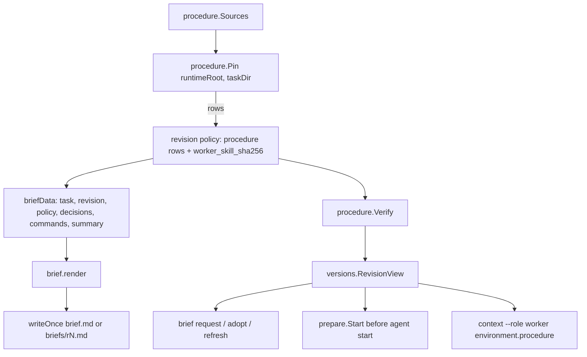

# Unified brief renderer and pinned worker procedure - Plan

## Goal Capsule

- **Objective:** A worker, fresh or recovered, can rebuild its full operating instructions, approved task, and unapplied decisions from records sum retains, even after a runtime update or rollback; a decision-only refresh costs the worker a small, bounded read instead of a second copy of the whole procedure; and sum refuses to publish or launch a brief whose mandatory procedure is missing or altered, with an error that says how to recover.
- **Means:** One renderer for every brief revision (KTD1), the worker procedure pinned as a write-once, content-addressed task resource referenced by hash (KTD2, KTD3), fail-closed validation at publish, request, adopt, and launch (KTD4), and bounded `context` as the primary read in briefs, refresh messages, and return notices (KTD5, KTD6).
- **Authority:** Issue #205, then this plan, then `VERIFY.md` and the feature maps.
- **Stop:** No prompt registry, skill synchronizer, database, delta protocol, automatic restart, or network fetch. Do not rewrite historical briefs or migrate sidecars. Do not rewrite worker-procedure content beyond factual references to the brief format (#204 owns content). Keep #203, #206, #207, #208, #209 behavior intact. Keep `brief_schema` 1 so rollback stays possible (KTD7).
- **Execution profile:** Standard Go change in `go/internal/{procedure (new), brief, versions, prepare, refreshcmd, returns, contextview}`, fake-Herdr CLI regressions, minimal skill/doc edits, feature-map rows, canonical verifier.
- **Who finishes:** The implementer lands, verifies, opens the PR, and (granted for this run) squash-merges after CI is green.

---

## Product Contract

### Summary

Briefs today are produced by two overlapping templates (`brief.Render` for r1, `brief.RenderFull` for later revisions) and each embeds the full 16 KB `skills/sum-worker/SKILL.md`. A refresh therefore resends and asks the worker to reread that procedure even when only a decision changed, and `WorkerSkill` returns an empty string on a read error, so a brief can be written with no procedure at all. The procedure is also referenced by a path inside the runtime root, which is the mutable installation checkout when no release is active.

### Problem Frame

Workers pay input tokens for every file a refresh asks them to read. The procedure is the largest and most stable part of a brief. It must still be available to a fresh or recovered session without a previous chat or the installation's current HEAD, and its absence must be loud rather than silent.

### Requirements

**Rendering**

- R1. Initial creation and every regeneration produce a brief through one renderer taking explicit revision, policy, decision, change-summary, and command data. Legitimate differences (revision id, decisions, change summary, previous revision) are data, not template branches.
- R2. The task-specific brief keeps the approved objective, repository, checkout, branch, base, harness, verification and graph state, policy references, current decisions, and exact return commands.

**Procedure resource**

- R3. The worker procedure is stored as an immutable, write-once task resource named by its content hash and referenced from the brief by absolute path, byte size, and sha256. A pinned task never points at the mutable installation checkout or the network.
- R4. A fresh session is told to read every required procedure resource before other work; a session that already read a resource with the same hash is told it need not reread it. sum never records or infers that the agent read a file.
- R5. The resource reference is a list, so a later change can split or shrink the procedure into several files without changing the renderer.

**Fail closed**

- R6. A missing, unreadable, empty, or manifest-mismatched mandatory procedure source prevents writing a new brief or revision, with an actionable error; `prepare` checks it before any Herdr side effect.
- R7. A pinned resource that is missing or no longer matches its recorded hash makes the revision unusable for `brief request`, `brief adopt`, refresh delivery, and `start`/`execution resume`, and never widens authority.

**Reading**

- R8. A decision-only revision's refresh message tells the worker to read the changed decisions through bounded `context` and adopt, not to reread the whole brief; other revisions still name the full file.
- R9. Briefs, return notices, and the worker procedure present role-specific bounded `context` as the primary answer and status read; full `show` is for explicit inspection.
- R10. `context --role worker` reports the pinned procedure resources of the active revision with their integrity, so a recovered worker can find them from the task record.

**Compatibility**

- R11. Existing briefs, approval fingerprints, frozen policy, refresh and adoption receipts, and older sidecars stay valid and unmodified; revisions without procedure resources keep working; state backups carry the pinned procedure files; generated commands and file references work for state homes and checkouts whose paths contain spaces and for release-tree runtimes.

**Measurement**

- R12. The PR reports total worker input (launch prompt plus every file or command output the worker is told to read) for the initial brief and a decision-only refresh, before and after, with the method.

### Scope Boundaries

- Instruction content, size, and loading policy of `skills/sum-worker/SKILL.md` stay as they are except for the lines that describe the brief format or name the read mechanism this change replaces (the Delivered runtime paragraph, refresh step 2, and the answer-reading line), which R8 and R9 require (#204 owns the rest).
- Legacy notice mirrors (#210) are untouched.
- The coordinator contract refresh (`refreshCoordinator`) keeps its current behavior.

---

## Planning Contract

### Key Technical Decisions

- KTD1. **One renderer over a `briefData` value.** `brief.render(data)` is the only template. `WriteInitial` and `Regenerate` build the data (revision id, policy, decisions or nil, commands, change summary, previous id) and call it. The former r1-only omissions (launch note, revision invariants, handoff guidance) were drift, not intent, so r1 gains them.
- KTD2. **Pin into the task directory, content-addressed.** New package `internal/procedure` owns `Sources` (today one entry: `sum-worker` from `skills/sum-worker/SKILL.md`, required) and pins each source to `<task>/procedure/<name>-<sha256[:16]>.md` with write-once semantics. The task directory is the one resource guaranteed to survive runtime update, rollback, and archive; it works whether the runtime is a release tree or the installation checkout; identical content is reused across revisions, and a changed procedure gets a new file while the old one is retained. Rejected: referencing the runtime release tree, because the runtime is the mutable installation checkout when no release is active, and #205 forbids pinning a task to mutable HEAD.
- KTD3. **The reference is a list of rows in the revision policy.** `policy.procedure = [{name, source, path, sha256, bytes, load, when}]`, with `path` relative to the task directory like revision paths (so a restored backup under another home still resolves), rendered absolute only in brief text, recorded beside the existing `worker_skill_sha256` (kept for older readers and change summaries). The renderer iterates the rows: `load: required` rows are read before work, others are listed with their `when`. #204 changes `procedure.Sources` or its content, never the renderer. (session-settled: user-directed — chosen over a renderer hard-coding one file: #204 will split the procedure next.)
- KTD4. **Validation at every boundary that publishes or launches.** `procedure.Pin` refuses a missing, non-regular, empty, oversized, or (when `release.json` is present) manifest-mismatched source, and refuses an existing pinned file whose hash differs (it is never overwritten; the error names the file, its recorded and actual sha256, and the recovery: move the file aside, then `brief regenerate` re-pins it from the verified source, which also restores any older revision that references the same hash). `procedure.Verify` rechecks pinned rows; `versions.RevisionView` calls it, so request, adopt, refresh, and `context` see an unusable revision. `prepare.Prepare` preflights sources before creating a Herdr checkout; `prepare.Start` verifies the active revision (brief file and procedure) before any agent start and prompts that revision's file. (session-settled: user-directed — chosen over `WorkerSkill` returning an empty string: it silently wrote incomplete briefs.)
- KTD5. **Decision-only refresh reads through `context`, judged against the active revision at delivery.** A requested revision is decision-only when its policy (procedure rows included), commands, and approved fingerprint equal those of the task's `active` revision, the one the worker actually read; the latest staged revision is not the baseline, because an unadopted procedure change would otherwise be adopted silently. One helper (`versions.DecisionsOnly`) decides it for both delivery paths: `refreshTask`'s message and the returns pump's `refresh` notice line. Decision-only deliveries name `context TASK --role worker --section decisions` plus the adopt command, and the revision file only as the complete record for a fresh session; others keep "read the file". Nothing new is stored on the revision and no delta format is introduced.
- KTD6. **`context` first, `show` for inspection.** The brief's return channel lists `context --role worker` as the way to read answers and status, and `show` as the full record for explicit inspection. The return notice names `context TASK --role <role>` for worker and coordinator recipients and keeps `show` for any other role. The recorded `commands` object keeps its keys, so fingerprints and change summaries do not churn.
- KTD7. **No brief schema bump.** New fields are additive and old helpers ignore them; bumping `brief_schema` would make `update` block rollback for every task written by this release. A revision regenerated by an older helper after rollback renders the inline procedure again, which is valid.

### High-Level Technical Design

### Assumptions

- `prepare` preflights the procedure source before any Herdr call; a source that changes between that check and pinning (a concurrent release activation) fails the prepare through the existing `failPrepare` path, which is accepted as rare.
- A tampered pinned file in one task still aborts a fleet `refresh request` at that task, as any `Regenerate` error does today; changing fan-out error handling is out of scope.

- A source larger than 256 KiB is refused as a runaway file; today's procedure is 16 KB.
- No tokenizer is available offline, so the measurement reports bytes and labels any token figure an estimate.

### Sequencing

U1 (procedure package) precedes U2 (renderer) and U3 (validation). U4 (refresh and notices) and U5 (context) follow U2. U6 (skills, docs, maps) and U7 (measurement) come last.

---

## Implementation Units

### U1. Procedure resource package

- **Goal:** Pin, describe, and verify the worker procedure as a content-addressed task resource.
- **Requirements:** R3, R5, R6, R7
- **Files:** `go/internal/procedure/procedure.go`, `go/internal/procedure/procedure_test.go`
- **Approach:** `Source{Name, Path, Load, When}`, `var Sources`; `Check(runtimeRoot) error` (preflight, no writes); `Pin(runtimeRoot, taskDir) ([]any, error)` returning ordered rows; `Verify(taskDir, rows) error`; `Rows(policy)` reader; `Sha(rows, name)`. Release manifest comparison reads `files[source]` (`sha256:<hex>`) from `release.json` when present. Errors name the source path, the runtime, and the recovery (`mise run setup` in that runtime, or activate a verified release), and say no brief was written.
- **Test scenarios:** pin writes a 0600 file named by hash and returns rows with bytes, sha, and a task-relative path; a second pin of the same content reuses the file; changed content gets a new file and leaves the old one; missing, empty, oversized (over 256 KiB), symlinked, and directory sources refuse; a release manifest whose hash differs refuses; a tampered existing pinned file refuses; `Verify` reports missing and mismatched files and accepts intact ones; a task directory whose path contains spaces works.
- **Verification:** `go test ./internal/procedure/`

### U2. One brief renderer

- **Goal:** Replace `Render` and `RenderFull` with one renderer fed by `WriteInitial` and `Regenerate`.
- **Requirements:** R1, R2, R4, R5, R9, R11
- **Files:** `go/internal/brief/brief.go`, `go/internal/brief/regenerate.go`, `go/internal/brief/brief_test.go`
- **Approach:** `briefData` struct; `render` emits the sections once. `## Brief revision` gains the change summary and previous revision for r2+. `## Delivered runtime` names the helper and the pinned procedure rows. `## Worker procedure` lists each row (absolute path, bytes, sha256, load rule) instead of inlining text. `Policy` becomes `policyFor(rows)`; `revisionSummary` also reports a procedure-reference change and a switch from inline to pinned procedure. Delete `WorkerSkill`.
- **Test scenarios:** initial and regenerated briefs share every section heading in the same order; r1 says no decisions and no change summary; r2 lists each decision state (open, answered, closed-unapplied, applied) and its change summary; neither brief contains the procedure body; both name the pinned absolute path and full hash; a home with spaces yields shell-quoted commands that parse back to the intended argv; a runtime missing the procedure makes `WriteInitial` and `Regenerate` fail with nothing written; the leftover `skills/worker` alias is never read.
- **Verification:** `go test ./internal/brief/`

### U3. Fail-closed validation at request, adopt, and launch

- **Goal:** No incomplete brief is requested, adopted, or launched.
- **Requirements:** R6, R7
- **Files:** `go/internal/versions/versions.go`, `go/internal/prepare/prepare.go`, `go/internal/backup/backup.go`, `go/internal/cli/brief_procedure_test.go` (new), backup test
- **Approach:** `RevisionView` calls `procedure.Verify` for revisions that carry rows. `Prepare` calls `procedure.Check` before any Herdr call. `Start` builds the active revision's view under the lock, refuses when it is not `ok` (naming the recovery), and prompts that revision's path. `backup` adds every revision's procedure row paths, refusing symlinks as it does today.
- **Test scenarios:** dispatch through the CLI with a runtime lacking the procedure refuses before any Herdr `worktree`/`agent` call; dispatch with a real runtime writes `procedure/sum-worker-*.md` and the brief references it; deleting or editing the pinned file makes `start` refuse with no agent start and makes `brief request` refuse; after moving the tampered file aside, `brief regenerate` re-pins it and `brief request` succeeds; a backup of a dispatched task contains the pinned file; legacy tasks and revisions without rows keep working.
- **Verification:** `go test ./internal/cli/ -run 'Procedure|Brief'`

### U4. Decision-only refresh and context-first notices

- **Goal:** A decision-only refresh reads through `context`; notices point at bounded `context`.
- **Requirements:** R8, R9
- **Files:** `go/internal/brief/regenerate.go`, `go/internal/refreshcmd/refresh.go`, `go/internal/returns/pump.go`, affected tests under `go/internal/returns/` and `go/internal/cli/`
- **Approach:** `versions.DecisionsOnly(versionsObj, target)` compares against the active revision; `refreshTask` and the pump's `refresh` notice line branch on it; `noticeText`'s trailer uses `context TASK --role ROLE` for worker and coordinator. Also quote the revision path in the refresh message (it is unquoted today and breaks on a home with spaces).
- **Test scenarios:** answering a question and running `refresh request` delivers a message naming the `context ... --section decisions` command and the adopt command; a procedure change produces the full-file message; a procedure-change revision left unadopted followed by an answer and another `refresh request` still produces the full-file message; a worker busy at `refresh request` later receives the pump notice with the same decision-only wording; notices name `context --role worker` for a worker and `--role coordinator` for the coordinator.
- **Verification:** `go test ./internal/returns/ ./internal/refreshcmd/ ./internal/cli/`

### U5. Worker context names the pinned procedure

- **Goal:** A recovered worker finds its procedure from `context --role worker`.
- **Requirements:** R10
- **Files:** `go/internal/contextview/contextview.go`, `go/internal/cli/context_test.go`
- **Approach:** the environment section adds `procedure`: rows of the active revision with absolute path, bytes, sha256, load, and `ok`/`error` from `procedure.Verify`; null for revisions without rows.
- **Test scenarios:** a dispatched task's worker context lists the pinned file with `ok: true`; a tampered file shows `ok: false` with an error.
- **Verification:** `go test ./internal/cli/ -run Context`

### U6. Skill, docs, and feature maps

- **Goal:** Keep every statement about the brief format true without rewriting the procedure.
- **Requirements:** R4, R9, R11
- **Files:** `skills/sum-worker/SKILL.md` (Delivered runtime paragraph, refresh step 2, answer-reading line), `skills/sum-dispatch/SKILL.md` and `skills/sum-update/SKILL.md` if they describe the inline copy, `docs/features/coordination.md` (new `brief.unified-renderer` and `brief.procedure-resource` rows, updated `fleet.mixed-version` implementation list), `docs/features/verification.md` implementation list, `go/internal/cli/fleet_test.go` (rollback assertion reads the pinned procedure instead of the brief body).
- **Test scenarios:** `tests/test_operating_files.py` and the skills tests stay green; the fleet test proves update writes a new pinned file, rollback reuses the update-one file by hash, and old revision files are unchanged.
- **Verification:** canonical verifier.

### U7. Measurement

- **Goal:** Report total worker input for the initial brief and a decision-only refresh, before and after.
- **Requirements:** R12
- **Files:** a scratch script outside the repository; numbers land in the PR body.
- **Approach:** dispatch one task with the fake Herdr using the base helper and the candidate helper, answer one question, run `refresh request`, and sum the bytes of the launch prompt plus every file or command output each instruction tells the worker to read.
- **Verification:** numbers recorded in the PR body with the method.

---

## Verification Contract

| Check | Command | Proves |
| --- | --- | --- |
| Targeted suites | `cd go && go test ./internal/procedure/ ./internal/brief/ ./internal/versions/ ./internal/returns/ ./internal/refreshcmd/ ./internal/cli/` | U1-U6 behavior |
| Canonical aggregate | `MISE_ENABLE_TOOLS=go,python,node python3 .agents/skills/verify/scripts/verify_run.py --base "$(git merge-base origin/main HEAD)"` | full offline suite, demo, maps |
| CI | `gh pr checks` | same runner in GitHub Actions |

`mise run test-live` is not run (no Herdr lab required for these rows).

## Definition of Done

- One renderer; `Render`, `RenderFull`, and `WorkerSkill` are gone.
- New briefs reference pinned procedure files; none embeds the procedure body.
- Missing or mismatched procedure refuses publish, request, adopt, and start with an actionable error.
- Decision-only refresh and notices use bounded `context`.
- Feature maps and skill references updated; canonical verifier passes; measurements in the PR body; no leftover experimental code.
