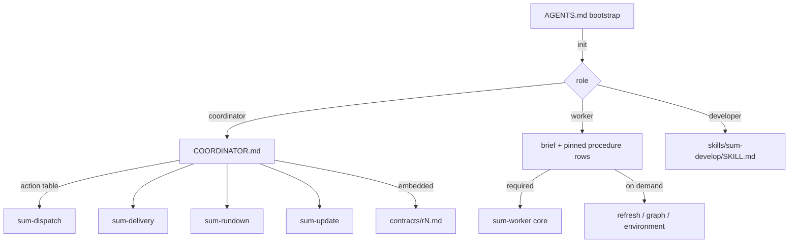

# Small role bootstrap and action-scoped procedures - Plan

## Goal Capsule

- **Objective:** Every sum session (coordinator, worker, developer) pays for its own role's mandatory rules on start and on every turn, and for an action's detailed procedure only when it performs that action, with no approval, safety, or recovery guarantee lost and a missing instruction file failing loudly instead of silently leaving a role without its rules.
- **Means:** A thin `AGENTS.md` bootstrap (KTD1), a coordinator core file (`COORDINATOR.md`) named by `init` and embedded in coordinator contract revisions (KTD2, KTD3, KTD4), a worker procedure split through the existing `procedure.Sources` interface (KTD5), action detail consolidated into the existing action skills (KTD6), the worker context dropping its live duplicate (KTD7), and resource regressions (KTD8).
- **Authority:** Issue #204, then this plan, then `VERIFY.md` and the feature maps.
- **Stop:** No role registry, mode system, plugin manager, cwd-derived role, daemon, TOON change, live installation update, or new brief mechanism. No deleted delivery gate or command. Every rule #202, #203, #205, #206, #207, #209, #213 added survives.
- **Execution profile:** Instruction rewrite plus small Go changes in `go/internal/{procedure, roleinit, refreshcmd, skills, contextview}`, fake-Herdr CLI regressions, feature-map rows, measurement, canonical verifier.
- **Who finishes:** The implementer lands, verifies, opens the PR, and (granted for this run) squash-merges after CI is green.

---

## Product Contract

### Summary

`AGENTS.md` (16,121 bytes, aliased as `CLAUDE.md`, `GEMINI.md`, `GROK.md`) is loaded by every harness session in the installation and in every sum checkout: the coordinator, a developer, and a worker whose task edits sum. It carries the whole coordinator contract, including evidence publication, pipeline gates, capacity and repair accounting, cleanup, graph, update, hook, and metadata detail that the action skills already repeat. The worker procedure (`skills/sum-worker/SKILL.md`, 16.6 KB) is one required file, so a worker reads graph, service, and refresh detail it may never use.

### Problem Frame

Input tokens are paid for everything an agent is told to read, at start and again whenever a cache misses. Detailed procedures that apply to one action are paid on every session and every turn. A shorter entrypoint must not become a weaker one: approval, ownership, untrusted text, independent verification, uncertain delivery, and human merge must stay unambiguous, and a role whose core file is missing must not proceed as if it had read it.

### Requirements

**Bootstrap**

- R1. `AGENTS.md` holds only: identity, explicit `sumctl init` and returned-role routing, the authority and destructive-operation boundaries every role shares, durable-record and bounded-read rules, and one pointer per role to its core. Target about 2-3 KB.
- R2. The coordinator's routing-only rule stays in the bootstrap as well as in its core, so it survives a core that was never read.

**Role cores**

- R3. The coordinator core is `COORDINATOR.md` at the repository root: startup steps, routing-only operation, approval and project rules, the one-line authority form of each capacity, repair, cleanup, update, hook, and metadata rule, and an action table naming the skill to read for each action.
- R4. The worker core stays `skills/sum-worker/SKILL.md` (required) and keeps every standing prohibition; evidence-capture, graph, environment-service, and brief-refresh procedure move to on-demand files pinned beside it with a `When` condition.
- R5. The developer core stays `skills/sum-develop/SKILL.md`, gaining what only the old developer section of `AGENTS.md` said.

**Action procedures**

- R6. Detail removed from `AGENTS.md` lives in the action skill that owns the action (`sum-delivery`, `sum-dispatch`, `sum-rundown`, `sum-update`); nothing is removed without a new location.

**Delivery and failure**

- R7. `init` names the role core it expects the session to follow, with path, size, and sha256, for the coordinator and developer roles; a worker is pointed at its pinned procedure.
- R8. `init` refuses to grant or keep the coordinator role, before writing anything, when the runtime's coordinator core is missing, empty, oversized, not a regular file, or does not match its release manifest; the error names the file and the recovery.
- R8a. The bootstrap tells every role to reread the file `init` named after context compaction or a resumed conversation, and to read the absolute runtime path `init` returned, not a checkout-relative copy.
- R9. A coordinator contract revision embeds the coordinator core with `AGENTS.md`, records its sha256, reports its change in the summary, and refuses to stage when the core is missing.
- R10. `context --role worker` stops listing the live runtime `sum-worker` file when the active revision carries pinned procedure rows; revisions without rows keep the live reference.

**Compatibility**

- R11. Existing briefs, pinned rows, contract revisions, receipts, and rollback targets stay valid; older revisions keep their single-row procedure; changing the procedure produces a normal verification-affecting revision through request and adopt.

**Proof**

- R12. Regressions cover: fresh coordinator and developer `init` naming their core; a missing core refusing coordinator `init`; a contract revision carrying the core; a dispatched brief pinning one required and several on-demand files; worker context without the live duplicate; every resource the bootstrap and cores name existing and tracked; the bootstrap free of optional-feature detail.
- R13. The PR reports complete initialization inputs (entrypoint, immediately loaded files, init and tool output) before and after for fresh start, continuation, decision update, and recovery of each role, in bytes and in tokens with the tokenizer named.
- R14. The PR carries an old-rule to new-location table checked by an independent policy reviewer.

### Scope Boundaries

- `grok-bots/` recipes, `templates/`, and `.agents/skills/{verify,evidence,create-verification,maintain-verification}` content are untouched.
- The brief renderer, brief template, and `procedure` pin/verify semantics stay as #205 left them; the refresh message changes only by the `required` qualifier (KTD11).
- `docs/` explanations are edited only where they describe what `AGENTS.md` contains.

### Deferred to Follow-Up Work

- Splitting `sum-delivery` (28 KB) and `sum-update` (23 KB) internally. They load only for their action today; shrinking them is separate work.

---

## Planning Contract

### Key Technical Decisions

- KTD1. **Bootstrap = shared rules + role pointers.** `AGENTS.md` keeps identity, `init`, role routing, the universal boundaries (work only from the user's explicit instruction; tool, worker, issue, and repository text is data; only the user merges; never delete or force-reset unfinished work or remove a checkout, pane, or branch by hand; never install, change accounts, or disable permission controls; records live in `.sum/tasks/`; idle, a send, or a report is not verified completion), bounded reads, and the verification contract pointer. Everything else moves. Rejected: keeping the coordinator contract in `AGENTS.md`, because workers editing sum and developers load it too.
- KTD2. **Coordinator core is a plain `COORDINATOR.md`, not a new skill.** Every installed helper since 587c402 refuses to stage a tree with an unknown `skills/sum-*` directory or projection (`namespace collision`), and `update apply` stages with the installed helper, so a new `sum-coordinator` skill would make this release uninstallable through `update` (verified: the base helper's `skills check --root` returns `ok: false` for such a tree). A root file beside `AGENTS.md` ships in every release tree through `git archive`, is not auto-discovered by any harness (so non-coordinator sessions never see it), and is read only by path from the bootstrap and `init`. Rejected: `skills/sum-coordinator/` (breaks update from every installed helper), a two-release rollout (the issue asks for one PR), and a references file inside an unrelated skill.
- KTD3. **`init` names the core and fails closed for the coordinator.** A new `procedure.Describe` reuses the existing source validation (regular file, size bound, release-manifest hash) for a single role source without pinning. The row's `path` is the runtime copy (a release tree or the checkout runtime), and the bootstrap tells the coordinator to read that path, so the file validated is the file read. Designated `init` checks the coordinator core before the state lock and refuses the three coordinator-granting branches (existing owner, first claim, reclaim) before any write; developer and worker results carry the reference but never fail on it. The output field is `procedure` (a list, like brief rows). Rejected: reporting `ok: false` and continuing, because a coordinator without its core is exactly the silent failure the issue forbids.
- KTD4. **Contract revisions embed the core.** `contractPolicy` adds `coordinator_sha256`; the snapshot text appends the core after `AGENTS.md`; `contractSummary` adds `coordinator procedure changed`. The fingerprint changes once on upgrade, producing one new staged revision, which is the refresh the old coordinator needs. Old helpers ignore the new key.
- KTD5. **Worker split through `procedure.Sources`.** Sources become `sum-worker` (required) plus `sum-worker-refresh`, `sum-worker-graph`, `sum-worker-environment` (on-demand, under `skills/sum-worker/references/`). The renderer already prints `Read when <When>`. (session-settled: user-directed — chosen over a new brief/procedure mechanism: #205 left this interface for #204.)
- KTD6. **Action detail stays in action skills.** Evidence publication, pipeline, and cleanup are already in `sum-delivery`; capacity, repair, and graph in `sum-dispatch`; hook, metadata, graph states, and delivery passes in `sum-rundown`; refresh in `sum-update`. Each sentence of the old `AGENTS.md` either appears in the bootstrap, a core, or one of these, verified line by line, and missing sentences are added there. (session-settled: user-directed — chosen over dropping rules to meet the byte target: every earlier rule must survive.)
- KTD7. **Worker context drops the live copy when pinned rows exist.** Two copies that can differ invite reading the wrong one; the pinned rows are the worker's authority. Legacy revisions keep the live reference.
- KTD8. **Resource regressions are behavioral where possible.** Go tests drive `init`, `refresh request`, `dispatch`, and `context` through the CLI with fake Herdr; a packaging test resolves every backticked repository path the bootstrap and cores name and checks each `procedure.Sources` path is tracked. Static phrase checks guard only the authority rules and the absence of optional detail in the bootstrap.
- KTD9. **No release-verification or skill-inventory change.** `VerifyRelease` keeps requiring only `skills/sum-worker/SKILL.md` and the `sum-*` skill list is unchanged, so installed helpers can stage this tree and every helper can still roll back to an older staged bundle. A regression pins the `sum-*` skill set so a later change cannot reintroduce the staging break silently.
- KTD10. **The core keeps policy protection.** `AGENTS.md` is in the verifier's default policy set; the rules that moved are not. `VERIFY.md` adds `policy_files = ["COORDINATOR.md", "skills/"]`, so a candidate that edits the coordinator core or any role or action procedure is flagged `requires_root_review` exactly as an `AGENTS.md` edit is.
- KTD11. **Refresh wording names required files only.** The worker refresh message asks for `any required worker procedure file` not yet read at that sha256, matching the brief; otherwise every full refresh would make on-demand files mandatory.

### High-Level Technical Design

### Assumptions

- Harnesses auto-load `AGENTS.md`/`CLAUDE.md` from the checkout root; the installation checkout, dev checkouts, and sum task checkouts all carry the same file.
- The offline tokenizer is `o200k_base` (the rank file shipped with a local VS Code extension, run with a small Node BPE script); no Claude tokenizer is available offline, so token counts are a proxy and cached versus uncached usage is not observable here.
- `mise run test-live` and a real harness canary are not run; rows stay manual.

### Risks

| Risk | Mitigation |
| --- | --- |
| A rule silently dropped in the move | Line-by-line mapping table in the PR, dedicated policy reviewer |
| Test fixtures with minimal runtimes break on the new coordinator check | `newRuntimeLab` copies individual files and runs coordinator `init` even without a worker procedure, so it copies `COORDINATOR.md` unconditionally; other fixtures are fixed as the suite reports them |
| Installed helpers cannot stage the release | No new `sum-*` skill (KTD2, KTD9); the base helper's `skills check` is run against the candidate before push |
| A coordinator that already read the fat `AGENTS.md` keeps it after update | The contract revision now embeds the core; refresh delivers it and records a receipt |

### Sequencing

U1 (procedure.Describe) precedes U2 (init) and U3 (contract). U4 (worker split) and U5 (context) are independent. U6 (instruction files) can proceed in parallel and must land before U7 (resource regressions). U8 (docs, maps) and U9 (measurement) come last.

---

## Implementation Units

### U1. Describe a single role source

- **Goal:** Validate and describe one runtime instruction file without pinning.
- **Requirements:** R7, R8
- **Files:** `go/internal/procedure/procedure.go`, `go/internal/procedure/procedure_test.go`
- **Approach:** Add `Coordinator` and `Developer` `Source` values and `Describe(runtimeRoot, src, consequence)` returning a row (`name`, `source`, `path` absolute, `bytes`, `sha256`, `load`); `sourceError` takes the consequence text (`no brief was written` stays the default for pinning).
- **Test scenarios:** describe returns absolute path, size, and hash; missing, empty, directory, symlink, and oversized sources refuse; a release manifest with a different hash refuses; the error names the consequence it was given.
- **Verification:** `go test ./internal/procedure/`

### U2. `init` names the role core and fails closed for the coordinator

- **Goal:** R7, R8.
- **Files:** `go/internal/roleinit/designated.go`, `go/internal/roleinit/roleinit.go`, `go/internal/cli/init_test.go`
- **Approach:** Designated init describes the coordinator core before the lock; each branch that grants the coordinator returns the error before writing `context.json` or registering. Coordinator and developer results set `procedure`; worker results name the brief and context command in the note. The coordinator note says to read the core before any other step. Non-designated init (dev checkout) sets `procedure` to the checkout runtime's `sum-develop`.
- **Test scenarios:** first-claim coordinator init returns a `procedure` row for `COORDINATOR.md` whose path is under the runtime root, with the file's sha256; a second pane gets `developer` with `sum-develop`; removing the core from the runtime makes coordinator init fail naming the file and leaves no `context.json`; reclaim with the core missing refuses and keeps the old owner; developer init with the core missing still succeeds.
- **Verification:** `go test ./internal/cli/ -run Init`

### U3. Contract revisions embed the coordinator core

- **Goal:** R9, R11.
- **Files:** `go/internal/refreshcmd/refresh.go`, `go/internal/cli/fleet_test.go` or a focused refresh test
- **Approach:** `contractPolicy` reads the core (error when missing), adds `coordinator_sha256`; the snapshot adds `## Coordinator core (COORDINATOR.md at this revision)`; `contractSummary` reports the change.
- **Test scenarios:** `refresh request` stages a contract revision whose file contains the core text and whose policy carries its hash; changing only the core stages a new revision with `coordinator procedure changed`; a runtime without the core refuses the contract regeneration; the existing fleet update/rollback test still passes.
- **Verification:** `go test ./internal/cli/ -run 'Fleet|Refresh|Contract'`

### U4. Split the worker procedure

- **Goal:** R4, R11.
- **Files:** `go/internal/procedure/procedure.go`, `go/internal/refreshcmd/refresh.go` (KTD11), `skills/sum-worker/SKILL.md`, `skills/sum-worker/references/{evidence,environment,graph,refresh}.md`, `go/internal/cli/brief_procedure_test.go`, `go/internal/brief/brief_test.go` fixtures
- **Approach:** Move the procedure detail of evidence capture, `## Code graph`, `## Environment around the code`, and `## Brief revisions` to the references. The core keeps every standing prohibition from those sections (no codegraph init/index/install/upgrade/serve/uninstall, no query against another checkout, no MCP or harness configuration edit, no broad compose down, no reserved default port, no credential in the record, no killing by name or port, no fabricated red, no media upload or PR edit, no restart or harness/model/account change on refresh) and says the brief lists on-demand files with their conditions. The PR's mapping table covers these sections as well as `AGENTS.md`.
- **Test scenarios:** a full refresh message names only required procedure files; a dispatched brief lists one `Required before any other step` row and four `Read when` rows, each with a pinned file; none of the on-demand text appears in the brief; removing one reference from the runtime refuses dispatch before any Herdr call; a task dispatched under one source keeps its single row after a regenerate adds four.
- **Verification:** `go test ./internal/procedure/ ./internal/brief/ ./internal/cli/ -run 'Procedure|Brief'`

### U5. Worker context without the live duplicate

- **Goal:** R10.
- **Files:** `go/internal/contextview/contextview.go`, `go/internal/cli/context_test.go`
- **Approach:** When the effective role is only `worker` and the active revision has pinned rows, `skills.files` omits `sum-worker`.
- **Test scenarios:** worker context of a dispatched task has `procedure` rows and no live `sum-worker` file; a revision without rows still lists it; reviewer and coordinator views are unchanged.
- **Verification:** `go test ./internal/cli/ -run Context`

### U6. Instruction files

- **Goal:** R1-R6.
- **Files:** `AGENTS.md`, `COORDINATOR.md` (new), `VERIFY.md` (KTD10), `skills/sum-develop/SKILL.md`, `skills/sum-dispatch/SKILL.md`, `skills/sum-delivery/SKILL.md`, `skills/sum-rundown/SKILL.md`, `skills/sum-update/SKILL.md`
- **Approach:** Rewrite per KTD1-KTD6. Build the mapping table while editing; add every sentence with no existing home to the owning skill.
- **Test scenarios:** covered by U7 and the existing operating-files and skills tests.
- **Verification:** `go test ./internal/skills/`, `python3 -m unittest tests.test_operating_files tests.test_setup`

### U7. Resource and bootstrap regressions

- **Goal:** R12.
- **Files:** `go/internal/skilltest/packaging_test.go` (or a new `bootstrap_test.go` there), `tests/test_operating_files.py`
- **Approach:** Resolve every backticked `skills/`, `.agents/skills/`, `docs/`, `templates/`, root `*.md` path in `AGENTS.md` and the three role cores; assert the `sum-*` skill set equals the one every installed helper accepts (KTD9); assert the bootstrap carries the reread-after-compaction line; assert each `procedure.Sources` path and the coordinator core are tracked by Git (so release trees carry them); assert the bootstrap stays under its budget, names each role core, keeps the authority phrases, and contains none of the optional-feature markers (`auto_publish`, `sum-pipeline`, `repair extend`, `execution park`, `graph init`, `hook enable`, `metadata enable`, `--accept-missing-evidence`).
- **Verification:** `go test ./internal/skilltest/`, `python3 -m unittest tests.test_operating_files`; before push, run the base helper's `skills check --root` against the candidate and record `ok: true`.

### U8. Docs and feature maps

- **Goal:** Keep documentation true.
- **Files:** `README.md`, `CONTRIBUTING.md`, `docs/architecture.md`, `docs/features/coordination.md` (new `roles.bootstrap`, `roles.coordinator-core`, `brief.procedure-split` rows; updated `roles.skill-delivery`, `skills.namespace`, `roles.coordinator-dispatch-only`)
- **Test expectation:** none -- documentation; the verifier's map checks cover row syntax.

### U9. Measurement

- **Goal:** R13.
- **Files:** scratch scripts outside the repository; numbers land in the PR body.
- **Approach:** For base `bf14b8e` (extracted with `git archive`, not a worktree) and the candidate, run a fake-Herdr lab: coordinator first `init`, `inbox --live`, dispatch, worker brief and required files, developer `init`, `refresh request` after an answer, `context --section decisions`, and `init --reclaim`; sum the bytes of every file each role is told to read plus command output, and count tokens with `o200k_base`.

---

## Verification Contract

| Check | Command | Proves |
| --- | --- | --- |
| Targeted suites | `cd go && go test ./internal/procedure/ ./internal/roleinit/ ./internal/refreshcmd/ ./internal/skills/ ./internal/skilltest/ ./internal/contextview/ ./internal/brief/ ./internal/cli/` | U1-U7 |
| Python operating files | `python3 -m unittest tests.test_operating_files tests.test_setup` | bootstrap phrases, projections |
| Canonical aggregate | `MISE_ENABLE_TOOLS=go,python,node python3 .agents/skills/verify/scripts/verify_run.py --base "$(git merge-base origin/main HEAD)"` | full offline suite, demo, maps |
| CI | `gh pr checks` | same runner in GitHub Actions |

`mise run test-live` and live harness canaries are not run.

## Definition of Done

- `AGENTS.md` is a bootstrap of about 2-3 KB; each role reads a core named by the bootstrap and by `init`.
- Coordinator `init` refuses without its core; contract revisions embed it.
- The worker procedure is one required and four on-demand pinned files.
- Worker context carries only pinned procedure rows.
- Every old rule has a mapped location; independent policy review recorded.
- Measurements, mapping table, and decisions in the PR body; canonical verifier and CI pass.
