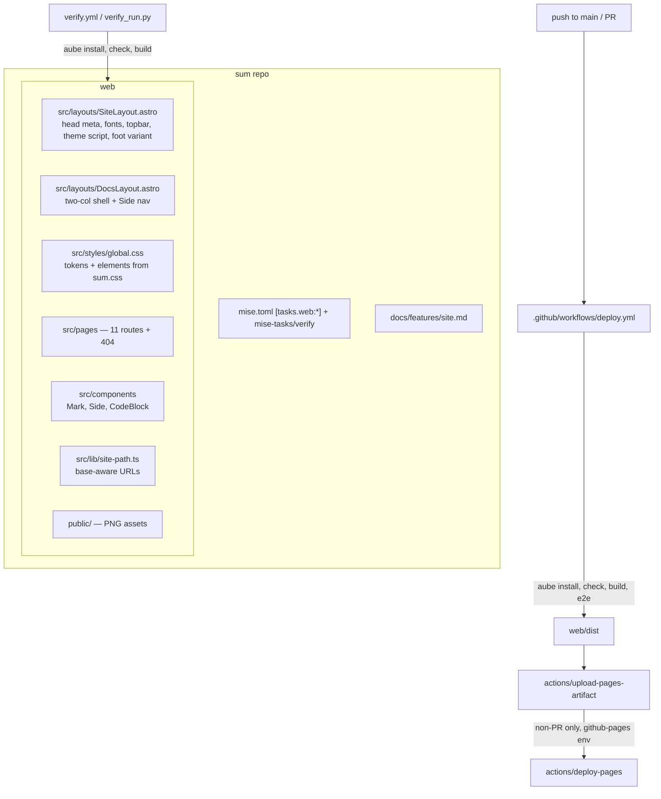

# feat: Public website for sum (Astro + GitHub Pages)

## Goal Capsule

- **Objective:** sum has a public website at `https://douglasjarquin.github.io/sum` that presents the project — what it is, how to install and configure it, how verification and the Herdr backend work, and the remainder reference implementation — rendered in the designed visual system.
- **Means:** A static Astro site in `web/`, built and deployed to GitHub Pages by a repository workflow, mirroring the established sf2-themes pattern (KTD1, KTD2).
- **Authority:** This plan governs. Where this plan is silent, `web/DESIGN.md` (the distilled design contract) is authoritative for visual decisions, and the design source under `~/Downloads/design-sum/` is authoritative for page content. Repo conventions (`VERIFY.md`, `AGENTS.md`) override both on process.
- **Execution profile:** Standard depth, single checkout `.sum/dev/site` on branch `sum-dev/site`, executed inline by the running session.
- **Stop conditions:** A requirement contradicts the design source; the Pages deploy target (`douglasjarquin/sum` project page) turns out wrong; any change would require touching the live installation.
- **Finishes and ships:** This session implements, verifies, and opens the PR. The user merges.

---

## Product Contract

### Summary

Build a static documentation site for sum under `web/` in this repository. The site implements the supplied design source — a full design system (`sum.css` + `Sum Design System.dc.html`) and an 11-screen site mockup (`Sum Site.dc.html`) — as real Astro routes. It deploys to GitHub Pages from `main` via a new workflow modeled on `deploy.yml` in sf2-themes, is packaged with `aube` through mise like the reference project, and is covered by a `docs/features/site.md` feature map plus repo verification wiring.

### Problem Frame

sum is a coordinator for durable agent tasks; its concepts (task folders, handoff reports, verification records, the paired `remainder` executable) are documented only in-repo. A public site makes the project legible to a visitor in one scroll, gives install/verification instructions a stable URL, and carries the "Many agents. One finished task." brand the design files establish. The design work is already done — what is missing is the site.

### Requirements

- R1. `web/` is an Astro static site that builds to `web/dist` and serves these eleven routes: `/`, `/remainder/`, `/docs/`, `/install/`, `/architecture/`, `/verification/`, `/skills/`, `/configuration/`, `/herdr/`, `/update/`, `/remainder-cli/` — plus a minimal styled `404.astro` (Pages plumbing, not a designed route). Page content is ported faithfully from `Sum Site.dc.html` — its actual prose, code samples, and tables — with hash routes (`#/install`) translated to real routes.
- R2. One shared stylesheet implements the design system, distilled from `sum.css` and the mockup's inline styles: color tokens for light and dark (`--bg`, `--ink`, `--body`, `--muted`, `--rule`, `--accent`, `--soft`, `--blend`), JetBrains Mono body + Instrument Serif display, thin rule/border grid (1240px max-width column with edge rules, 1px-gap cell grids, border-top page sections), no radii or shadows, and the elements the pages use (topbar, cells, kv grid, codeblock, blockquote, side nav, foot, eyebrow labels, chip list).
- R3. Theme matches the design's mechanism exactly: `data-theme` on `<body>` is written only on an explicit override from `localStorage` key `sum-site-theme`; when absent, `@media (prefers-color-scheme: dark)` styles `:root`/body directly so the site follows the OS live — including with JS disabled. The topbar toggle writes the opposite of the effective theme (system or saved), the label names the theme it will switch to (`light` when effective is dark), and the title reports "Following system theme" vs the active override. An inline head script applies the saved override before first paint.
- R4. Astro is configured for the GitHub Pages project path: `site` `https://douglasjarquin.github.io`, `base` `/sum`, `trailingSlash` `"always"`. Every internal URL — topbar, footer, docs index cells, sidebar, page links — is generated through a base-aware `sitePath()` helper so links resolve identically in `astro dev` and on Pages.
- R5. `.github/workflows/deploy.yml` builds `web/dist` on every event, uploads it as a Pages artifact and deploys to GitHub Pages only on `main`-ref push or dispatch events, with the deploy job bound to the `github-pages` environment. Pull requests get a build-and-check gate, never an artifact upload or deploy.
- R6. Favicon and social assets ship from `web/public/`: `favicon-32.png`, `favicon-64.png`, `apple-touch-icon-180.png`, `icon-512.png`, `og-1200x630.png`, `sum-mark-800.png`. Head meta matches the design's helmet: `og:title` "sum — Many agents. One finished task.", `og:description` "Dispatch approved work to isolated agents. A small Herdr-native distro: coordinator, workers, verification.", `twitter:card` `summary_large_image`. The raw `.dc.html` design sources and the `exports/` bundle are not committed.
- R7. The topbar shows the six-disc brand mark (a component, not an image) + "sum" + the muted tagline "Herdr-native agent distro" + nav (docs, install, remainder, GitHub ↗) + the theme toggle. Every docs-shell page carries the sidebar nav in three labeled groups — `sum` (8 links: Documentation, Install, Architecture, Verification, Skills, Configuration, Herdr backend, Update & rollback), `remainder` (Overview, Providers & CLI contract), `source` (AGENTS.md ↗, COORDINATOR.md ↗, VERIFY.md ↗ to GitHub blob URLs) — with the active entry marked (`aria-current`, accent left border + weight 600 on the rail, accent border on chips) and the rail collapsing to wrapped chips below 720px via pure CSS.
- R8. Semantic and accessibility basics hold everywhere: real `<a>` links, landmark structure, correct focus and contrast in both themes, and full content rendering with JavaScript disabled (the theme toggle is the only JS-enhanced element).
- R9. Tooling mirrors sf2-themes: `aube = "2.2.4"` pinned in `mise.toml`, `aube-lock.yaml` committed, tasks defined as `[tasks."web:install"]`-style entries in `mise.toml` (`web:install`, `web:deps` (Playwright browser install, mirroring sf2's `deps` task), `web:check`, `web:build`, `web:test`, `web:dev`). `web/package.json` scripts: `dev`, `build`, `preview`, `check`, `test:unit`, `test:e2e`, `test`.
- R10. The canonical verifier knows the site exists: `mise-tasks/verify` also installs web deps, runs `astro check`, and builds the site; `VERIFY.md` reflects that across all four places (`[requires].commands`, the setup install line, the `MISE_ENABLE_TOOLS` guidance, the automated-checks description); `.github/workflows/verify.yml` installs `aube`; `docs/features/site.md` maps the site scenarios and `docs/features/README.md` links it.
- R11. `web/DESIGN.md` distills the design system (tokens, type rules, element grammar, responsive and theme behavior, mark recipe) so the design intent lives in-repo; `web/AGENTS.md` records web-surface conventions (aube boundary, `sitePath` rule, generated dirs, `web:deps`).

### Key Decisions

- **Site lives in this repo at `web/`** (session-settled: user-approved — chosen over a separate repo or `docs/` subfolder: mirrors sf2-themes, the pattern the user named). Governs R1, R9.
- **"Just like SF2-Themes" stack** — Astro static output, aube for dependency management, mise task names, Playwright + node:test coverage shape (session-settled: user-directed — chosen over npm/pnpm and lighter test coverage: user selected `Full mirror`). Governs R5, R9, R10.
- **Design source distilled, not vendored** — `.dc.html` files stay in `~/Downloads`; the repo gets `web/DESIGN.md` plus the exported PNGs it needs (session-settled: user-approved — chosen over committing the design bundle). Governs R6, R11.
- **Sum's visual identity is given, not designed here** — the tokens, typography, mark, and "kraft-paper terminal" tone come from `Sum Design System.dc.html` + `sum.css` + `Sum Site.dc.html`; implementation matches, it does not reinterpret. Content is ported from the mockup verbatim; the only planned divergence is flagging where the mockup's text drifts from repo truth (see Open Questions). Governs R1, R2, R3, R7.

### Acceptance Examples

- AE1. Given the site deployed at `/sum`, when a visitor opens `/`, they see the topbar (mark, "sum", "Herdr-native agent distro" tagline, nav, theme toggle), then the hero: serif "Many agents. / *One finished task.*" (em in accent) with the lead and the Install / How it works buttons, the right rail of three labeled cells (Coordinator / Process owner / Records), the six numbered feature cells (01–06, including the nine delivery-gate chips on cell 02), the Quick start / How it works two-col, and the home foot (MIT / "Stands on …" / Documentation / "Sister project: remainder").
- AE2. Given a dark-mode OS preference and no saved override, any page renders the dark palette via the CSS media query and `body` has no `data-theme`; pressing the "Light" toggle writes `data-theme="light"`, persists across reload, and the label then reads "Dark".
- AE3. Given any docs-shell page at a viewport under 720px, the sidebar renders its three groups as wrapped chips; at or above 720px it renders as a left rail with group labels.
- AE4. Given a pull request, the deploy workflow installs, checks, builds, and runs e2e, and stops before the Pages artifact upload and deploy; on merge to `main` it deploys.

### Scope Boundaries

- Deferred to Follow-Up Work: wiring the site URL into repo docs beyond a README pointer; a `web:dev:local` portless task (sf2 has it — only worth adding if local dev actually uses it); syncing site prose when in-repo docs drift — the site is a snapshot of the design's copy, and `web/DESIGN.md` should note that keeping it true is manual.
- Outside this product's identity: no docs search, no blog/changelog pages, no dynamic content, no pages beyond the eleven designed routes plus the 404, no restyling beyond the given design system.

### Open Questions

- Is `douglasjarquin/sum` public with Pages enabled and Source set to "GitHub Actions"? The site markets install-via-clone and deep-links GitHub blob URLs; a private repo makes the first deploy and those links fail. Implementation proceeds regardless (the deploy prerequisite is named in U6 and the PR); this only gates go-live.
- Resolved at planning time: the mockup names bundled skills `/sum-worker`, `/sum-delivery`, `/sum-rundown`; those directories exist but their SKILL.md front matter says each is "the old name of" `sum-work`, `sum-deliver`, `sum-status`. The site ports the mockup's skills section verbatim except the six rows use the canonical names, since the page teaches the product.

---

## Planning Contract

### Key Technical Decisions

- KTD1. **Astro static site at `web/`** (session-settled: user-approved — chosen over a separate repo: mirrors sf2-themes). `astro.config.mjs`: `output: "static"` (Astro 7 default), `site: "https://douglasjarquin.github.io"`, `base: "/sum"`, `trailingSlash: "always"`. Pin `astro@7.3.1` — requires node `>=22.12`, satisfied by the existing `node = "22.20.0"` pin; no node bump.
- KTD2. **aube as the web package manager** (session-settled: user-directed — chosen over npm/pnpm: "just like SF2-Themes"). Pin `aube = "2.2.4"` (the version the reference repo runs). All web dependency/install commands go through `aube`; `aube-lock.yaml` is committed; `web/.npmrc` contains exactly `node-linker=hoisted` — sf2's `web/AGENTS.md` documents it as load-bearing for Astro prerender resolving native bindings from the aube (pnpm-style isolated) tree.
- KTD3. **Full test mirror** (session-settled: user-approved — chosen over build-only verification: user selected Full mirror). Three layers, same shape as sf2: `astro check` (typescript + `@astrojs/check`), `node --test` unit tests in `web/test/` for `sitePath()` and any data modules, and `@playwright/test` e2e in `web/tests/e2e/` driving `astro preview`.
- KTD4. **Real routes replace the mockup's hash navigation.** Each `href="#/x"` becomes a `sitePath("x")` link; external `https://github.com/...` links pass through untouched. Content is ported verbatim from the mockup — the implementer re-derives every string from `Sum Site.dc.html` rather than trusting this plan's prose about content, which the plan intentionally keeps at screen-inventory level.
- KTD5. **Pages base `/sum`** on `douglasjarquin.github.io` (project page for `douglasjarquin/sum`). Assumes no custom domain; if the repo's Pages settings differ, only `base`/`site` change.
- KTD6. **Design distilled to `web/DESIGN.md`** (session-settled: user-approved — chosen over vendoring `design-sum/`). Only the PNGs the site serves are copied into `web/public/`; everything else is distilled documentation.
- KTD7. **Verifier coverage split — unconditional web block, deliberately.** `mise-tasks/verify` gains `aube -C web install`, `aube -C web run check`, `aube -C web run build` after the Go suite, so "site builds + typechecks" is `automated` coverage in `docs/features/site.md`. The coupling is accepted, not hidden: a registry/aube outage then blocks `mise run verify` for non-web changes too, and cold CI pays the install+build (~1-2 min under `cache: false`). sf2-themes gates web checks behind `paths-filter`; sum does not, because `verify` is the canonical per-candidate check for every role and the site is a permanent product surface — a simpler always-on contract beats path-conditioned verification. Playwright e2e needs a ~100MB browser, so it lives in the deploy workflow and `mise run web:test`, recorded `manual` in the feature map.
- KTD8. **No framework islands.** The entire site is static HTML/CSS; the only client JavaScript is the inline theme script (read `sum-site-theme`, write `body[data-theme]` only when set) plus the toggle handler — no copy buttons, no resize logic (the 720px sidebar collapse is pure CSS), no JS dependencies beyond dev tooling.
- KTD9. **Brand mark recipe: the site mockup's values, verbatim.** `Mark.astro` renders six absolutely-positioned discs inside a square of configurable `size` (22px in the topbar): each disc `oklch(0.72 0.17 H)`, opacity `.85`, `mix-blend-mode: var(--blend)` (`multiply` light / `screen` dark — the only per-theme change), hues and offsets exactly as in `Sum Site.dc.html`'s topbar markup (hues 25/80/145/200/250/300 at the shown left/top positions, scaled proportionally). The colors are literal values in the component, not tokens. `Sum Brand.dc.html` uses a different dark recipe (0.68/.6) — the site mockup is authoritative for the site; `web/DESIGN.md` records the discrepancy.
- KTD10. **Footers are per-screen content, not one shell footer.** The mockup ships three footers: home (MIT / "Stands on Firstmate, Herdr, Oh My Pi, Solo, Unpeel, and others" / Documentation / "Sister project: remainder"), remainder (MIT / remainder repo link / "Pinchos and Sum remain independent consumers."), docs shell (MIT / sum and remainder repo links / "↑ home"). `SiteLayout` exposes a `foot` variant prop; `DocsLayout` supplies the docs foot; the home and remainder pages supply theirs.

### High-Level Technical Design

Dependency order: U1 scaffolding unlocks everything; U2 (shell/design system) precedes U3/U4 (pages); U5 can land any time after U2; U6 (CI + verification wiring) is last.

### Assumptions

- GitHub Pages for `douglasjarquin/sum` uses the default project site (`/sum` base, `douglasjarquin.github.io` domain), and the repo is or will be public with Pages Source set to "GitHub Actions" (see Open Questions).
- The `aube` mise tool resolves in CI via `mise-action` the same way `mise ls-remote aube` resolved locally.
- `aube -C web exec playwright install --with-deps chromium` works on the GitHub-hosted Ubuntu runner.
- The design source under `~/Downloads/design-sum/` remains readable for the duration of implementation; once content is ported, the repo copy is the surviving record (the `.dc.html` is intentionally not committed).

### Sources / Research

- Design source (not committed): `~/Downloads/design-sum/uploads/GitHub banners and design system/uploads/Sum project design/` — `Sum Site.dc.html` (all 11 screens' content, theme/sidebar logic), `Sum Design System.dc.html` + `sum.css` (tokens/elements), `Sum Brand.dc.html` (mark recipe — differs from the mockup's; KTD9), `exports/*.png` (assets).
- Reference implementation: `/Users/douglasjarquin/github/douglasjarquin/sf2-themes` — `web/` layout (note: `.npmrc` is `node-linker=hoisted`; tsconfig is bare `astro/tsconfigs/strict`; web tasks are inline `[tasks."web:*"]` in `mise.toml`; `deps` task installs the Playwright browser), `.github/workflows/deploy.yml` (incl. the `github-pages` environment and the Pages-source prerequisite comment), `web/test`/`web/tests` split, `web/AGENTS.md`, `DESIGN.md` shape.
- Repo contracts: `VERIFY.md`, `mise-tasks/verify` (aggregate script), `.github/workflows/verify.yml` (`MISE_ENABLE_TOOLS`, `install_args`), `docs/features/README.md` (map format), `.gitignore`.
- Astro 7.3.1 npm metadata: `engines.node >=22.12.0` — repo pin 22.20.0 satisfies it.

---

## Implementation Units

### U1. Web app scaffold and tooling

- **Goal:** `web/` exists as a working Astro skeleton; mise can install, check, build, and e2e-test it.
- **Requirements:** R1 (shell only), R4, R9.
- **Files:** `web/package.json`, `web/astro.config.mjs`, `web/tsconfig.json`, `web/.npmrc`, `web/src/env.d.ts`, `web/src/lib/site-path.ts`, `web/test/site-path.test.mjs`, `web/playwright.config.mjs`, `web/tests/e2e/smoke.spec.mjs` (minimal: `/` returns 200 under preview), `web/src/pages/index.astro` (placeholder), `mise.toml` (aube pin + `[tasks."web:*"]`), `.gitignore`.
- **Approach:**
  1. Mirror sf2's `web/` manifests exactly where they apply: `.npmrc` is `node-linker=hoisted` (KTD2), `tsconfig.json` is `{"extends": "astro/tsconfigs/strict"}` only — no extra flags beyond what sf2 ships.
  2. `astro.config.mjs`: `site`, `base: "/sum"`, `trailingSlash: "always"`; `sitePath()` joins `import.meta.env.BASE_URL` with a route and normalizes slashes, modeled on sf2's `site-path.ts`.
  3. `web/package.json` engines `node: ">=22.12.0"`; dev deps `astro@7.3.1`, `@astrojs/check`, `typescript`, `@playwright/test` (1.62.x line, matching sf2).
  4. Tasks go in `mise.toml` as `[tasks."web:install"]` etc. — flat `mise-tasks/web-install` files register as `web-install`, not the required colon names. `web:deps` runs `aube -C web exec playwright install chromium`; `web:test` runs unit + e2e (`aube -C web run test`), documenting that a fresh machine needs `mise run web:deps` first.
  5. `playwright.config.mjs` mirrors sf2's (webServer → `aube run build && aube run preview`, `PLAYWRIGHT_PORT` env override, `testDir: "tests/e2e"`).
  6. `.gitignore`: `web/node_modules/`, `web/dist/`, `web/.astro/`, `web/test-results/`, `web/playwright-report/`, `web/dev.url`.
- **Execution note:** mostly packaging/config; first proof is `mise run web:install` + `mise run web:build` producing `web/dist`, then `mise run web:deps` + `aube -C web run test:e2e` passing the smoke spec.
- **Patterns to follow:** sf2 `web/` root manifests, sf2 `[tasks."web:*"]` toml entries, sf2 `playwright.config.mjs`.
- **Test scenarios:**
  - `sitePath()` joins base + route correctly: `sitePath("install")` → `/sum/install/` in build context; no double slashes; root → `/sum/` (unit test).
  - `sitePath()` mirrors whatever input normalization sf2's helper has (leading slash, trailing slash) — port its tested cases.
  - E2E smoke: `astro preview` serves `/` with status 200.
- **Verification:** `mise run web:install`, `aube -C web run check`, `aube -C web run build`, `aube -C web run test:unit`, `aube -C web run test:e2e` (after `web:deps`) all green; `web/dist/index.html` exists.

### U2. Design system stylesheet and site shell

- **Goal:** The distilled design system and shared layouts exist; a page rendered through the shell looks like the design.
- **Requirements:** R1 (404 only), R2, R3, R7, R8, R11 (DESIGN.md); covers AE2, AE3.
- **Files:** `web/src/styles/global.css`, `web/src/layouts/SiteLayout.astro`, `web/src/layouts/DocsLayout.astro`, `web/src/components/Mark.astro`, `web/src/components/Side.astro`, `web/src/components/CodeBlock.astro`, `web/src/pages/404.astro`, `web/tests/e2e/theme.spec.mjs`, `web/tests/e2e/nav.spec.mjs`, `web/DESIGN.md`.
- **Approach:**
  1. `global.css` distills `sum.css` plus the mockup's inline styles into the element vocabulary the screens use: token block (base `:root`, `body[data-theme="dark"]`, and the `@media (prefers-color-scheme: dark)` fallback on the un-themed root — keep all three, R3), topbar, cell grids (`display:flex;flex-wrap:wrap;gap:1px;background:var(--rule)`), border-top sections, bordered code blocks, kv grids, blockquote, chips, sidebar rail + chip collapse at 719px, foot, eyebrow labels. Strip demo-only rules (canvas scroll, `preview-frame`, `simbox`).
  2. `SiteLayout.astro`: `<html lang="en">`; head with charset/viewport/title/description, the exact Google Fonts URL `css2?family=JetBrains+Mono:wght@400;500;600&family=Instrument+Serif:ital@0;1&display=swap` (the 600 weight and serif italic are load-bearing — topbar wordmark and hero `em`), favicon/apple-touch links, OG/Twitter meta (absolute `new URL(path, import.meta.env.SITE)`; internal links use `sitePath`), the inline theme script (R3), topbar (Mark + "sum" + "Herdr-native agent distro" + docs/install/remainder/GitHub ↗ + toggle button), `<slot/>`, and a `foot` prop/variant (KTD10).
  3. `Mark.astro`: `size` prop (default 22), six discs at the mockup's exact hues/offsets scaled to `size` (KTD9), `aria-hidden` (decorative — the wordmark text beside it carries identity).
  4. `Side.astro`: `nav.side` with the three labeled groups and 13 links (R7); active entry gets `aria-current="page"` plus the design's two active treatments.
  5. `DocsLayout.astro`: composes `SiteLayout` (docs foot variant) + the `.two-col` flex grid (`side` column `flex:1 1 220px`, content `flex:999 1 480px`, `max-width:760px` prose column) with `Side` — all 9 docs-shell pages share it.
  6. `CodeBlock.astro`: bordered block of `white-space:pre` lines — no copy button (the design has none; R8 bounds JS to the theme toggle).
  7. `404.astro`: SiteLayout + serif heading + a `sitePath("")` home link — a few lines, Pages plumbing.
  8. `web/DESIGN.md`: the design contract — tokens table, typography (families, weights, sizes, uppercase/tracking labels), geometry (1240px column, edge rules, cell-grid technique, section paddings), elements (each class's look and use), theme mechanism (three-layer tokens + override semantics), sidebar collapse, mark recipe (incl. the brand-doc discrepancy, KTD9), and the note that site copy is a snapshot needing manual sync when repo docs change.
- **Patterns to follow:** `sum.css` and `Sum Site.dc.html` for every rule/value; sf2 `SiteLayout.astro`/`SiteHeader.astro` for Astro component shape only.
- **Test scenarios:**
  - Covers AE2. E2E: dark `prefers-color-scheme` + empty storage → computed background is the dark token and `body` has no `data-theme`; click toggle → light palette + `data-theme="light"` + label "Dark"; reload keeps the override.
  - Covers AE3. E2E responsive: `.side` renders chips under 720px, rail at 1280px; active entry has `aria-current="page"` and the accent treatment in both modes.
  - E2E: toggle title reads "Following system theme" with no override; JS-disabled context still renders full content (and the dark palette under emulated dark).
- **Verification:** `astro check` clean; theme persistence + responsive nav e2e green; the 404 and a rendered page match the mockup visually at 1240px and 390px in both themes.

### U3. Home and remainder pages

- **Goal:** `/` and `/remainder/` render the designed screens.
- **Requirements:** R1, R2, R8; covers AE1.
- **Files:** `web/src/pages/index.astro`, `web/src/pages/remainder/index.astro`, `web/tests/e2e/home.spec.mjs`.
- **Approach:**
  1. `/`: hero split (serif h1 "Many agents." + accent-em "One finished task.", lead, Install / How it works buttons → `sitePath("install")` / `sitePath("architecture")`), right rail of three labeled cells (Coordinator / Process owner / Records), six numbered feature cells 01–06 (including the nine gate chips inside cell 02 and the inline `→` links to verification/skills/herdr), Quick start / How it works two-col (the git clone → `herdr` → `mise trust` → `mise run setup` → `codex` block, the AGENTS.md first-prompt em line, and the you/coordinator/worker kv grid + "submitted, not acknowledged" note), home foot (KTD10).
  2. `/remainder/`: eyebrow "remainder · one-shot quota CLI", serif h1 "Local evidence, / *not a dashboard.*", lead, buttons (Providers & CLI contract → `sitePath("remainder-cli")`; github ↗ → remainder repo), six cells 01–06 (Selected providers / `--all` / Compact, JSON, TOON, scalar / Pace / Observation cache / Exit codes — cell 06 contains the 0/1/2/3/130 mini-grid), Install · first report / How it works two-col (curl install.sh + `remainder --provider codex --profile default`, the you/observation cache/report kv, honest-unavailable note), remainder foot (KTD10).
  3. Port text exactly from the mockup; every `#/…` link goes through `sitePath`.
- **Patterns to follow:** `Sum Site.dc.html` home and remainder screens.
- **Test scenarios:**
  - Covers AE1. E2E: `/` shows the "Many agents." + "One finished task." hero, the three rail cells, six numbered cells, the quick-start block containing `mise run setup`, and the "Sister project" foot.
  - E2E: `/remainder/` shows the eyebrow, the "Local evidence," hero, all six cells including the exit-codes grid (0/1/2/3/130), and the remainder foot.
  - E2E edge: every internal `<a href>` on both pages starts with `/sum/` after build; external GitHub links are untouched.
- **Verification:** `astro build` emits both routes; visual check against the mockup at 1240px and 390px.

### U4. Docs section pages

- **Goal:** The `/docs/` index and the eight section pages render inside `DocsLayout`.
- **Requirements:** R1, R7, R8.
- **Files:** `web/src/pages/docs/index.astro`, `web/src/pages/install/index.astro`, `web/src/pages/architecture/index.astro`, `web/src/pages/verification/index.astro`, `web/src/pages/skills/index.astro`, `web/src/pages/configuration/index.astro`, `web/src/pages/herdr/index.astro`, `web/src/pages/update/index.astro`, `web/src/pages/remainder-cli/index.astro`, `web/tests/e2e/docs.spec.mjs`.
- **Approach:**
  1. Page anatomy is what the mockup actually uses: serif h1 (44px) + lede + `padding:28px 0; border-top` sections with serif h2 (26px); content elements are cells, kv grids, bordered code blocks, tables/grids, blockquote — no breadcrumbs, page-title chrome, dek, side-kv, or next links exist in the design, so none are built.
  2. `/docs/` index: h1 + lede (terminology pointer), the 8-cell section link grid (Install, Architecture, Verification, Skills, Configuration, Herdr backend, Update & rollback, remainder), and the `docs/repairs.md` / `docs/recovery.md` / `docs/terminology.md` external-link rows.
  3. Per-page content (verbatim from the mockup): install (Install and launch code block, Recommended harnesses, No installed harness?, Talk to it blockquote); architecture (Session roles cells, State and communication + inbox/show/answer and context code blocks, Questions and returns, Three command classes grid, Manual dispatch code block); verification (Nine ordered gates cell grid + pipeline code block, Evidence publication, Brief revisions code block); skills (six-row skill table using the mockup's `/sum-*` names, Factory lane, Third-party skills, Verification authoring skills); configuration (Worker harness and model + settings code block, Named launch presets + preset code block, Capacity + settings.json shape block); herdr (Pane identity, Environments code block, Native event delivery, Native metadata + state chips); update (Update and roll back, Refresh running sessions, Runtime releases); remainder-cli (eyebrow + Providers kv rows, Formats code block, Exit codes grid).
  4. Each page sets `Side`'s active entry; `DocsLayout` supplies the docs foot.
- **Patterns to follow:** `Sum Site.dc.html` per-screen markup.
- **Test scenarios:**
  - E2E happy path: each of the 9 docs-shell routes returns 200 under preview and shows its h1 and its active sidebar entry.
  - E2E edge: the docs index cell links resolve to `/sum/<section>/`; the three `source` sidebar links and `docs/*.md` links point at `github.com/douglasjarquin/sum` and are not passed through `sitePath`.
  - E2E: `/skills/` shows the six skill rows with canonical names (`/sum-dispatch`, `/sum-work`, `/sum-deliver`, `/sum-status`, `/sum-develop`, `/sum-update`; resolved in Open Questions).
- **Verification:** all 11 routes plus 404 present in `dist`; each docs page's active nav state correct; `astro check` clean.

### U5. Favicon, social, and brand assets

- **Goal:** Real binary assets serve from `web/public/` and `dist/` contains them.
- **Requirements:** R6.
- **Files:** `web/public/favicon-32.png`, `web/public/favicon-64.png`, `web/public/apple-touch-icon-180.png`, `web/public/icon-512.png`, `web/public/og-1200x630.png`, `web/public/sum-mark-800.png`.
- **Approach:** copy the six PNGs from `~/Downloads/design-sum/.../exports/` into `web/public/`. All head references were already wired in U2 (`sitePath` for icon links, absolute `SITE` URLs for OG/Twitter) — this unit only supplies the files and verifies them.
- **Test scenarios:**
  - E2E: `<link rel="icon">`, `apple-touch-icon`, and `og:image` on `/` return 200 through `astro preview`; `og:image` is an absolute `douglasjarquin.github.io` URL.
- **Verification:** the six files exist in `web/dist/` at the expected paths after build.

### U6. CI, verification contract, and repo wiring

- **Goal:** The site builds, tests, and deploys through GitHub Actions; the repo's verification contract covers it.
- **Requirements:** R5, R9, R10, R11 (AGENTS.md); covers AE4.
- **Files:** `.github/workflows/deploy.yml`, `.github/workflows/verify.yml` (aube), `mise-tasks/verify` (web block), `VERIFY.md`, `docs/features/site.md`, `docs/features/README.md`, `web/AGENTS.md`, `README.md` (site link).
- **Approach:**
  1. `deploy.yml` mirrors sf2's, minus its Docker stage: a header comment carrying sf2's prerequisite note (repo Settings → Pages → Source must be "GitHub Actions"), `configure-pages` → checkout → `mise-action` (`install_args: node aube`) → `aube -C web install` → `aube -C web run check` → `aube -C web run build` → `aube -C web exec playwright install --with-deps chromium` → `aube -C web run test:e2e` → `upload-pages-artifact` (`path: web/dist`) → `deploy-pages` guarded `if: github.event_name != 'pull_request'` with `environment: {name: github-pages, url: <deploy output>}`. Permissions `pages: write`, `id-token: write`; concurrency group `pages` mirroring sf2. `playwright-report` uploaded as an artifact on failure.
  2. `mise-tasks/verify`: after the existing go build+test, append `aube -C web install && aube -C web run check && aube -C web run build` (KTD7 — unconditional, deliberately).
  3. `verify.yml`: add `aube` to `install_args` and to `MISE_ENABLE_TOOLS` so the aggregate's aube calls resolve.
  4. `VERIFY.md`: add `aube` to `[requires].commands`, update the setup line to `mise install go python node aube`, update the `MISE_ENABLE_TOOLS` guidance and the "CI enables only these three tools" wording, and document the web check/build steps under Automated checks; name `site.md` where maps are referenced.
  5. `docs/features/site.md`: feature map in the established format — build/typecheck/link-base scenarios `automated` (the aggregate), theme/sidebar/responsive/deploy scenarios `manual` (playwright via `mise run web:test` + the deploy workflow). Link it from `docs/features/README.md`.
  6. `web/AGENTS.md`: aube-not-npm boundary, `node-linker=hoisted` is load-bearing, `sitePath` rule for all internal URLs, generated dirs to ignore, `mise run web:deps` before first `web:test`, task names.
  7. `README.md`: add the site URL line near the top.
  8. PR body / handoff note: the go-live prerequisites the code cannot perform — repo public, Pages Source = "GitHub Actions" — so the reviewer sees them before merge (Open Questions).
- **Test expectation: none —** CI/workflow/config wiring; the workflow is proven by the PR build, and unit/e2e coverage lives in U1–U5's files.
- **Verification:** PR workflow green (install → check → build → e2e → artifact); `python3 .agents/skills/verify/scripts/verify_run.py --check` validates the updated contract/maps; final canonical verifier run records green.

---

## Verification Contract

| Gate | Command | When |
| --- | --- | --- |
| Web deps | `mise run web:install` (then `mise run web:deps` on a fresh machine) | after scaffold and lock changes |
| Types | `aube -C web run check` | every unit touching `web/src` |
| Unit tests | `aube -C web run test:unit` | U1 and lib changes |
| E2E | `aube -C web run test:e2e` | U2–U5; also in the PR workflow |
| Build | `aube -C web run build` | before handoff; `web/dist` inspected |
| Contract check | `python3 .agents/skills/verify/scripts/verify_run.py --check` | after U6 contract edits |
| Canonical verifier | `MISE_ENABLE_TOOLS=go,python,node,aube python3 .agents/skills/verify/scripts/verify_run.py --base "$(git merge-base origin/main HEAD)"` | once, at the end |
| Visual pass | `mise run web:dev` + browser, desktop + mobile, light + dark | bounded single pass before ship |

---

## Definition of Done

- All eleven routes plus the 404 build and render the designed screens in `web/dist`.
- `astro check`, unit tests, and playwright e2e are green locally; the PR deploy workflow is green.
- Theme behavior matches the design (system-follow without JS, persisted override, correct label/title); the sidebar's three groups render rail/chips correctly; all internal links resolve under the `/sum` base.
- `web/DESIGN.md`, `web/AGENTS.md`, `docs/features/site.md`, and the `VERIFY.md`/`verify.yml`/`mise-tasks/verify` updates are committed; no `.dc.html` or design-export source is in the diff.
- The canonical verifier produces a passing run record for this branch.
- Dead-end scaffolding (the U1 placeholder page replaced by real content, unused components) removed from the diff.
- A reviewable PR is open on `sum-dev/site` naming the go-live prerequisites (repo public, Pages Source = GitHub Actions); it is not merged.
